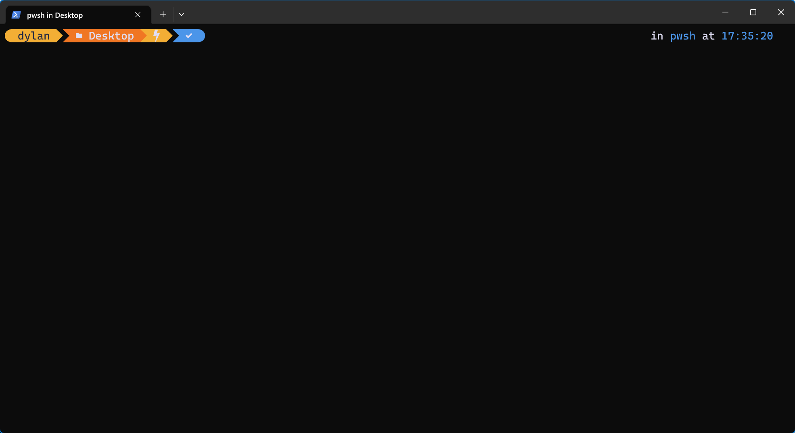
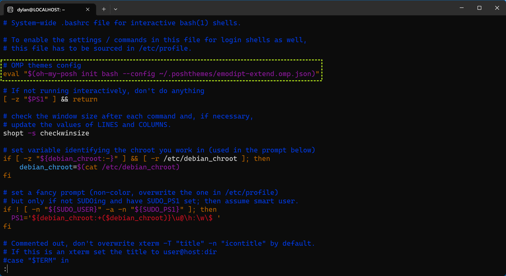

### OMP 概述

GitHub 上有一个美化终端的 [Oh My Posh](https://github.com/JanDeDobbeleer/oh-my-posh) 项目，使用 OMP 提供的主题配合 Powerline 字形，可以打造出一个更现代、更高效的终端工具。

WSL Bash 中的视图如下：


Git Bash 中的视图如下：


更多主题，请参考：[Oh My Posh - Themes](https://ohmyposh.dev/docs/themes)。

以下教程主要针对 Windows 11 终端及 WSL 终端的美化。

### Powerline 字形

使用 Oh My Posh 美化终端，需要使用字形（图形符号）来设置提示符的样式，否则终端中的某些字体会显示成乱码形态。若要在终端中查看所有字形，则需要安装 [Nerd Font](https://www.nerdfonts.com/font-downloads) 包含字形的字体。

Nerd Font 网站提供了字形字体的原始字体预览，可以根据需求自行下载相应的字形字体。

这里推荐使用 Cascadia Code 的字形字体 Caskaydia Cove Nerd Font：


下载解压，进入目录并选中所有的 .otf 文件，右键菜单中选择“为所有用户安装”即可。

### 终端字体设置

在 Windows 11 下，需要将常用终端的字体配置成支持 Powerline 字形的字体。


熟悉 JSON 格式，可以点击右下角的“打开 JSON 文件”直接对终端的样式进行编辑：


### OMP 安装


#### Windows

Windows 系统建议直接从项目的 [Releases](https://github.com/JanDeDobbeleer/oh-my-posh/releases) 列表中选择合适的安装包进行下载安装，这是一种可控制安装位置、安装用户的方式：


OMP 官网推荐使用的是 winget 命令行安装，winget 是一个综合的程序包管理器：


这种方式唯一的缺点是无法控制程序的安装位置，且只会为当前用户安装。

程序安装完毕后，OMP 的 bin 目录会同时配置到环境变量中：

- 安装包可选择安装路径及为全部用户安装还是为当前用户安装，区别是 bin 目录添加到环境变量的位置；
- winget 则会直接将程序安装到当前用户目录下，并将 bin 目录添加到当前用户的环境变量中。

安装完毕后，可以在 Windows PowerShell 中查看 OMP 的版本信息：

```shell
oh-my-posh --version
```


关于 Windows 下的 OMP 安装，可参考原文：[Oh My Posh - Windows](https://ohmyposh.dev/docs/installation/windows)。

#### Linux

Linux 系统下，推荐手动下载程序包：

```bash
sudo wget https://github.com/JanDeDobbeleer/oh-my-posh/releases/latest/download/posh-linux-amd64 -O /usr/local/bin/oh-my-posh
```

这是一种开箱即用的方式，程序包里已经包含了 OMP 程序本体，且目标目录为用户的 bin 目录，即等同于将 OMP 程序的 bin 目录添加到了环境变量中。

下载完毕后，需要给 oh-my-posh 程序赋予执行权限：

```bash
sudo chmod +x /usr/local/bin/oh-my-posh
```

程序包中不包含主题文件，需要单独下载：

```bash
mkdir ~/.poshthemes
wget https://github.com/JanDeDobbeleer/oh-my-posh/releases/latest/download/themes.zip -O ~/.poshthemes/themes.zip
unzip ~/.poshthemes/themes.zip -d ~/.poshthemes
chmod u+rw ~/.poshthemes/*.omp.*
rm ~/.poshthemes/themes.zip
```

以上命令从上而下分别用于：1. 创建隐藏目录；2. 下载主题压缩文件；3. 解压主题压缩文件；4. 为当前文件拥有者赋予读写的权限；5. 删除无用主题压缩文件。

注意，尽量不要批量运行以上命令，如果某个程序不存在，则该条命令的执行虽无效，但后续命令仍会执行。

例如 unzip 尚未安装，那么以上命令仍旧会创建目录并下载压缩文件，但解压命令和赋权命令会失败，由于删除文件的命令存在且不受此前失败命令的影响，最终压缩文件会被删除。

安装完毕后，可以直接在 Bash 中查看到 OMP 的版本信息：


关于 Linux 下的 OMP 安装，可参考原文：[Oh My Posh - Linux](https://ohmyposh.dev/docs/installation/linux)。

### Shell/Bash 配置

以下介绍 PowerShell 和 Bash 中的主题配置。

关于其他终端的美化，请参考原文档：[Oh My Posh - Prompt](https://ohmyposh.dev/docs/installation/prompt)。

#### PowerShell

为 Windows PowerShell 配置主题，需要修改它的配置文件。执行以下命令查看配置文件：

```shell
notepad.exe $PROFILE
```

如果此前并未配置过 Windows PowerShell，那么一般会得到以下提示：


这意味着配置文件不存在。执行以下命令创建一个配置文件：

```shell
New-Item -Path $PROFILE -Type File -Force
```


该配置文件默认位于 Documents\WindowsPowerShell 目录。

再次使用 notepad 程序命令打开配置文件，并添加以下配置：

```shell
oh-my-posh init pwsh | Invoke-Expression
```


保存并退出后，执行以下命令刷新配置：

```shell
. $PROFILE
```

默认主题即刻生效：



假如希望使用不同的主题，例如使用 oh-my-posh/themes/emodipt-extend.omp.json 主题配色，只需要打开配置文件，将内容更改为：

```bash
oh-my-posh init pwsh --config 'E:\oh-my-posh\themes\emodipt-extend.omp.json' | Invoke-Expression
```

重新打开 PowerShell 或使用命令刷新配置，主题就会被应用：


#### Bash

无论是 Git Bash 还是 Linux Bash，它们的加载文件通常都位于 /etc 目录，一般是名为 bash.bashrc 文件。

以 Git Bash 为例，应用默认主题配色，只需要在文件中添加以下配置：

```bash
eval "$(oh-my-posh init bash)"
```


配置即刻生效：


希望更换配置，只需要添加 config 参数指定主题 .json 文件的路径即可：

```bash
eval "$(oh-my-posh init bash --config /e/oh-my-posh/themes/emodipt-extend.omp.json)"
```


以 WSL 为例，修改 Bash 主题可以进入 Linux Shell 或其指定的 Linux 发行版的 Shell 中，将 OMP 配置添加到 /etc/bash.bashrc 文件：



再次启动 Linux Bash 主题即可生效：

