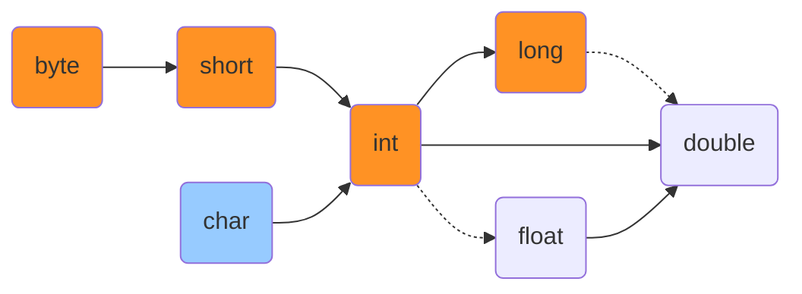

### 概述

1. Java 是一门面向对象的编程语言；
2. Java 主要用于编写网络应用程序的后台逻辑，如网页的后台、Windows 应用程序或手机 App 等；
3. Java 是一门高级的编程语言。所谓的高级语言，其底层都是由基础语言编写而成，Java 亦是如此；
4. Java 的代码运行在 JVM 上，JVM 全称是 Java Virtual Machine。Java 的多平台的可移植性，正正是依赖于 JVM 可以在多平台上运行。

### 数据类型

学习任何一门计算机语言，最基本的步骤是了解该门语言中的数据类型。

Java 中的数据类型分为两类：1. 基本数据类型；2. 引用数据类型。

基本数据类型具体分类：

|  类型   |                          大小及范围                          |
| :-----: | :----------------------------------------------------------: |
|  byte   |                       1 字节，-128~127                       |
|  short  |                     2 字节，-32768~32767                     |
|   int   |                     4 字节，-2^31~2^31-1                     |
|  long   |                     8 字节，-2^63~2^63-1                     |
|  float  | 4 字节，-3.40282347E+38F\~3.40282347E+38F（有效位数 6~7 位） |
| double  | 8 字节，-1.79769313486231570E+308~1.79769313486231570E+308（有效位数 15 位） |
|  char   |                       2 字节，0~65535                        |
| boolean |                      1 字节，true/false                      |

基本数据类型之间的转换关系：



其中，**实线**表示可以安全地进行转换，**虚线**则表示转换会丢失部分精度。

除去基本数据类型以外的所有其他类型，都属于引用数据类型。**（数组是特殊的类，它也属于引用数据类型。）**

### 流程控制

任何语言都离不开流程控制语句，Java 的基本流程控制语句有三类：判断、选择、循环。

#### 判断

关键字：if、else、else if

```java
public class Sample {
    public static void main(String[] args) {
        int num = 10;

        if (num < 0) {
            System.out.println("It's less than zero.");
        } else if (num >= 0 && num < 10) {
            System.out.println("It's more than zero meanwhile, less than ten.");
        } else {
            System.out.println("It's equal to ten or more than it.");
        }
    }
}
```

#### 选择

关键字：switch、case、break

```java
public class Sample {
    public static void main(String[] args) {
        int num = 4;

        switch (num) {
            case 1:
                System.out.println("It's one.");
                break; // do not forget
            case 2:
                System.out.println("It's two.");
                break;
            case 3:
                System.out.println("It's three.");
                break;
            default:
                System.out.println("I don't know.");
                break;
        }
    }
}
```

多重选择 switch 语句中，case 关键字能够接收的判断类型是**有限的**。它仅能接收以下几种类型：

1. **类型为 char、byte、short 或 int 的常量表达式；**
2. **枚举常量；**
3. **从 Java 7 开始，case 标签还可以是字符串字面量。**

用一种更为简单的思维来理解 switch...case 语句，**即 case 内部实际是采用 == 来完成对象间的比较。**

假设 switch 能够接收引用数据类型参数，那么 case 就只会比较该对象之间的地址是否一致，这显然不符合 switch...case 的设计逻辑，这也是为什么 case 关键字只能够接收有限的判断类型的原因。

**字符串字面量**存在于静态常量池，有别于普通的字符串对象，**字符串字面量**可以直接使用 == 完成比较，因此它可以作为 case 的入参。

#### 循环

关键字：for

```java
public class Sample {
    public static void main(String[] args) {
        for (int num = 3; num > 0; num--) {
            System.out.println("Now is " + num); // 3、2、1
        }
    }
}
```

关键字：while、do...while

```java
public class Sample {
    public static void main(String[] args) {
        int num = 3;

        while (num-- > 0) { // 变量num会先进行比较再进行自减
            System.out.println("I am " + num); // 2、1、0
        }

        do {
            System.out.println("I am " + num); // -1、0、1、2、3
        } while (num++ < 3); // 变量num会先进行比较再进行自增

        System.out.println("Finally, I am " + num); // 4
    }
}
```

while 和 do...while 类似：前者只有在满足条件的情况下，才会执行循环；后者则至少会执行一次循环，后续循环是否继续需要根据条件进行判断。

流程控制中，一般还会使用到 break、continue 关键字，它们用于中断流程。

### Class 类

Java 中事无巨细都需要涉及到 Class 类，类可以说是构成 Java 程序的基本单位。

简单的类通常都具备字段（变量） Field 和方法 Method 两种成员类型。除字段、方法外，类中还能编写诸如内部类、内部枚举类、内部抽象类、嵌入/内部接口和内部注解等其他成员类型。

```java
public class Sample {
    static int classField; // 静态变量
    int instanceField; // 成员变量

    static void classMethod() { /*静态方法*/ }

    void instanceMethod() { /* 成员方法 */ }

    private void sample() {
        class MethodInnerClass { /* 方法内部类 */ }
        MethodInnerClass methodInnerClass = new MethodInnerClass();
    }

    enum NormalEnum { /* 内部枚举类 */}

    interface NormalInterface { /* 嵌入/内部接口 */ }

    @Target(ElementType.METHOD)
    @Retention(RetentionPolicy.RUNTIME)
    @interface Any { /* 内部注解 */ }

    class NormalClass { /* 内部类 */ }

    abstract class AbstractClass { /* 内部抽象类 */ }
}
```

稍微需要注意的是**方法内部类**：方法内部类的定义必须在其实例化代码之前，否则编译器将报错。

### Abstract Class 抽象类

Abstract Class 抽象类实际就是使用 abstract 关键字修饰的类型，它和普通类有以下区别：

- 抽象类无法直接实例化。一个普通的类如果使用 abstract 关键字修饰，那么它就无法进行直接地实例化；
- 抽象类中可以定义抽象方法。但，**抽象类中没有抽象方法也是被允许的！**
- 抽象类中可以定义所有普通类中能够定义的成员类型。

抽象类的实例化共有两种实例化方式：

1. 借助抽象类的子类。子类覆写抽象类中所有的抽象方法后，子类即可被实例化；
2. 借助匿名内部类。实例化抽象类的同时覆写其中的所有抽象方法。

思考一下，什么情况下类必须使用 abstract 关键字修饰呢？答案是类具有抽象方法时。如果类中仅存在 abstract 修饰的成员类型，类上是不需要使用 abstract 关键字修饰的。

以下情况是被允许的：

```java
public class Some {
    abstract class Inside {/*...*/}
}
```

### Interface 接口 

Interface 接口在 Java 中是一个抽象类型，接口最初的定义是抽象方法的集合，以 interface 关键字声明。

注意，接口并不是类。接口和类同属于 Java 数据类型中的引用数据类型，它们是同等级的。类是用 class 定义，而接口是用 interface 定义。

接口中可定义的成员有：

|          成员           |                       说明                        |
| :---------------------: | :-----------------------------------------------: |
|          常量           |       默认隐式使用 public static final 修饰       |
|        抽象方法         |         默认隐式使用 public abstract 修饰         |
| 静态方法（Java 8 新增） | 需显式使用 static 修饰，默认隐式使用 public 修饰  |
| 默认方法（Java 8 新增） | 需显式使用 default 修饰，默认隐式使用 public 修饰 |
| 私有方法（Java 9 新增） |              需显式使用 private 修饰              |

```java
public interface Sample {
    int CONSTANT_NUM = 2; // 常量
    
    void abstractMethod(); // 抽象方法
    
    static void staticMethod() { /* 静态方法 */ }
    
    default void defaultMethod() { /* 默认方法 */ }
    
    private void privateMethod() { /* 私有方法 */ }
}
```

实际上，接口中不仅仅只能定义以上的成员类型，诸如内部类、内部枚举类等其他的成员类型也能够定义在接口之中。

但需要注意的是，在接口中定义的其他成员类型无法选择访问修饰符的类型。默认情况下接口统一隐式使用了 public static 对这些成员进行了修饰（其中，内部枚举类仅使用了 public 修饰）。

```java
public interface Some {
    enum NormalEnum { /* 内部枚举类 */ }

    interface NormalInterface { /* 嵌入/内部接口 */ }

    @Target(ElementType.METHOD)
    @Retention(RetentionPolicy.RUNTIME)
    @interface Any { /* 内部注解 */ }

    class NormalClass { /* 内部类 */ }

    abstract class AbstractClass { /* 内部抽象类 */ }
}
```

### 抽象类和接口的区别

1. 接口不具有构造方法；
2. 接口不具有静态代码块或代码块
3. Java 8 之前，接口中所有的方法必须是抽象方法（Java 8 新增了静态方法和默认方法，Java 9 新增了私有方法）；
4. 接口中的变量只能是用 public static final 修饰的常量；
5. 接口不能被继承（extends）了，但可以被实现（implements）；
6. 类支持多实现，但仅支持单继承；
7. 接口中只有私有方法是使用 private 修饰的，除此之外其他所有方法使用的访问修饰符都是 public；
8. 接口中声明的内部元素均隐式使用 public 修饰；除内部枚举类外，其他内部元素同时隐式使用 static 修饰。

### Enum 枚举

Enum 枚举类是一个特殊的类，一般表示一组常量，不常用。

枚举类使用范例：

```java
public class EnumTest {

    @Test
    public void test() {
        String currentSymbol = "EXTRA_LARGE";
        Size size = Enum.valueOf(Size.class, currentSymbol);

        // 比较两个枚举类型的值时，不需要使用equals，注意Size.EXTRA_LARGE的类型是Size，而不是String
        Assert.assertSame(size, Size.EXTRA_LARGE);
        
        // 额外信息为String类型
        Assert.assertEquals("XL", size.getExtraInfo());
        
        // 枚举类中的成员方法name()可以取出对应枚举类实例化对象所代表的值的String表示形式
        Assert.assertEquals(Size.EXTRA_LARGE.name(), SimpleSize.EXTRA_LARGE.name());
    }
}

/**
 * 枚举类Size中包含四个常量，其中可以使用小括号去定义该常量的一个或多个额外信息，该额外信息以String类型进行存储，
 * 需要作为私有构造器显式参数（形参）传入。因此，如果具备额外信息，则必须提供有参构造。
 * 此时定义Size类的私有字段extraInfo，将用于保存当前私有构造所传入的显式参数，即对应常量的额外信息。
 */
enum Size {

    SMALL("S"), MEDIUM("M"), LARGE("L"), EXTRA_LARGE("XL");

    private final String extraInfo;

    Size(String extraInfo) {
        this.extraInfo = extraInfo;
    }

    public String getExtraInfo() {
        return this.extraInfo;
    }
}

/**
 * 简单的枚举类。
 */
enum SimpleSize {
    SMALL, MEDIUM, LARGE, EXTRA_LARGE;
}
```

常用的获取枚举类实例化对象的方式有三种：

1. 枚举类中的枚举对象，相当于类中的常量，可以直接通过类名加枚举常量名称获取；
2. 通过 Enum.valueOf 静态方法，可以获取指定枚举类中指定名称的枚举类对象；
3. 通过指定枚举类的 valueOf 静态方法，可以获取指定名称的该枚举类对象。

```java
public class EnumTest {

    @Test
    public void test() {
        SimpleSize simpleSizeA = Enum.valueOf(SimpleSize.class, "MEDIUM");
        SimpleSize simpleSizeB = SimpleSize.valueOf("EXTRA_LARGE");

        Assert.assertSame(SimpleSize.MEDIUM, simpleSizeA);
        Assert.assertSame(SimpleSize.EXTRA_LARGE, simpleSizeB);

        int index = SimpleSize.SMALL.ordinal();
        Assert.assertEquals(0, index);

        SimpleSize[] values = SimpleSize.values();
        Assert.assertEquals(4, values.length);
    }
}

enum SimpleSize {
    SMALL, MEDIUM, LARGE, EXTRA_LARGE;
}
```

枚举类对象在对应枚举类中的索引位置，可以通过成员方法 ordinal 获取；可以通过枚举类中的静态方法 values 获取到对应的枚举类型中的所有枚举对象的数组。

### Annotation 注解

Annotation 注解又称 Java 标注，它是 JDK 5.0 引入的一种注释机制。Java 语言中的类、方法、变量、参数和包等都可以被标注的。

Java 允许通过反射获取标注内容。在编译器生成类文件时，标注会被嵌入到字节码中。

Java 虚拟机可以保留标注内容，在运行时可以获取到标注内容 ，当然它也支持自定义 Java 标注。

注解就像一个预设信息清单，程序如果需要自定义注解，那么必然会有对应的反射代码嵌入在程序内，用于获取程序上对应注解的对象。成功获取对应注解的对象后，即可通过注解中提供的方法，获取到相关的当前预设信息。

```java
@Target(ElementType.METHOD)
@Retention(RetentionPolicy.RUNTIME)
@interface Simple {
    String value() default "dylan";
}

public class AnnotationTest {

    @Test
    public void test() {
        try {
            Method annotationMethod = AnnotationTest.class
                    .getDeclaredMethod("annotationMethod");
            Simple simple = annotationMethod.getAnnotation(Simple.class);
            Assert.assertEquals("rose", simple.value());
        } catch (NoSuchMethodException e) {
            e.printStackTrace();
        }
    }

    @Simple("rose")
    public void annotationMethod() {

    }
}
```

注解其实类似于接口，但不同的是注解中不支持定义静态方法、默认方法或私有方法，它仅支持定义常量和抽象方法。且注解中的抽象方法，允许使用 default 关键字为方法设置一个默认的返回值。

既然与接口类似，注解是否可以采用匿名内部类的方式获取到注解对象？答案是肯定的。

```java
@Target(ElementType.METHOD)
@Retention(RetentionPolicy.RUNTIME)
@interface Simple {
    String value() default "dylan";
}

public class AnnotationTest {

    @Test
    public void test() {
        Simple simple = new Simple() {
            @Override
            public String value() {
                return "dylan";
            }

            @Override
            public Class<? extends Annotation> annotationType() {
                return Simple.class;
            }
        };

        Assert.assertEquals("dylan", simple.value());
    }
}
```

采用匿名内部类实例化注解对象时，要求必须覆写 annotationType 抽象方法，该方法是哪里来的呢？

Java 中的所有注解实际都实现了 Annotation 接口，该接口中有四个抽象方法：

```java
public interface Annotation {

    boolean equals(Object obj);

    int hashCode();

    String toString();

    Class<? extends Annotation> annotationType();
}
```

Simple 注解类型实现了 Annotation 接口：


采用匿名内部类实例化注解对象时，对象遵循所有类型继承自 Object 类型，因此 equal、hashCode 和 toString 方法都能从 Object 类中继承而来，剩下一个 annotationType 抽象方法是必须要求覆写的。

实际上，注解如果在方法上使用，那么当方法被加载时，Java 程序会默默完成该注解的匿名实例化过程：

```java
@Target(ElementType.METHOD)
@Retention(RetentionPolicy.RUNTIME)
@interface Simple {
    String value() default "dylan";
}

public class AnnotationTest {

    @Test
    @Simple
    public void test() {
        try {
            Method test = AnnotationTest.class.getMethod("test"); // load method
            Simple simple = test.getAnnotation(Simple.class);

            Assert.assertEquals("dylan", simple.value());
            Assert.assertEquals("Simple", simple.annotationType().getSimpleName());
        } catch (NoSuchMethodException e) {
            e.printStackTrace();
        }
    }
}
```

### 访问修饰符

Access Modifier 访问修饰符用于界定 Java 中成员的被访问权限，这样的访问修饰符有四个：public、protected、(default) 和 private。

假设所有的类均由 public 关键字修饰，则访问修饰符作用于类中成员时，其作用如下：

| Access Modifier |              Usage               |
| :-------------: | :------------------------------: |
|     public      |   所有同包、非同包的类均可访问   |
|    protected    | 仅限同包的类、非同包的子类可访问 |
|    (default)    |        仅限同包的类可访问        |
|     private     |          仅限当前类访问          |

类、接口等引用数据类型也需要使用访问修饰符，用于规定它们是否能够被其他类所访问，用于类或接口等数据类型的访问修饰符仅有两个：public 和 (default)。

```java
public class Some {
    // 访问修饰符用于修饰成员变量
    public int a = 1;
    protected int b = 2;
    int c = 3;
    private int d = 4;
    
    // 访问修饰符用于修饰成员方法
    public void methodA() {
        System.out.println("MethodA.");
    }
    
    protected void methodB() {
        System.out.println("MethodB.");
    }
    
    void methodC() {
        System.out.println("MethodC.");
    }
    
    private void methodD() {
        System.out.println("MethodD.");
    }
    
    // 访问修饰符用于修饰内部类
    public class InnerClassA {
        //..
    }
    
    protected class InnerClassB {
        // ..
    }
    
    class InnerClassC {
        // ..
    }
    
    private class InnerClassD {
        // ..
    }
}
```

**那为什么类或接口不能够使用 protected 或 private 修饰？**（虽然这是语法规定，但也可以思考一下。）

首先需要明确一点，之所以在类或接口上使用访问修饰符，是为了规定类或接口是否能够被其他的类所访问。只有其他的类拥有目标类或接口的访问权时，才能进一步谈论继承或实现。

那么也就是说，访问修饰符 protected 中相关的子类访问规则是没有用的。如果 protected 去除了相关的子类访问规则，它的作用即完全等同于访问修饰符 (default)。显然类或接口没有必要使用 protected 访问修饰符。

其次，同样是因为使用访问修饰符是为了规范其他类访问目标类或接口的访问规则，如果类或接口上用 private 修饰（假如生效），那么目标类或接口则等同于不接受任何访问，这显然是无意义的。

### 常用关键字

Java 常用的关键字有三个：static、final、abstract。

#### static

关键字 static 的作用有三个：

1. static 关键字可以用于静态代码块。静态代码块用于完成类加载时的相关初始化操作；
2. static 关键字可以修饰字段和方法。被修饰的字段和方法属于类，这些字段和方法会在类加载的时一并被初始化；
3. static 关键字可以修饰内部类、内部枚举类、内部抽象类、嵌入接口、内部注解等，被修饰的元素都属于类元素。

在访问权限允许的情况下，其他类可以通过类名加 static 关键字修饰的元素名称，完成对静态变量、静态方法或静态内部类的引用：

```java
public class Some {
    public static int a = 1;

    static void methodSome() {
        System.out.println("MethodSome.");
    }

    static class InnerClass {
        private void methodSome() {
            // 与方法访问成员变量的规则一致，在不存在对应局部变量的情况下，会向上查找相关的成员变量
            System.out.println(a);
        }
    }
}

// 同一文件下的其他非public修饰的类，算做同包下的其他类
class OutsideClass {
    Some.InnerClass innerClass = new Some.InnerClass();

    public void methodSome() {
        System.out.println(innerClass);
    }
}
```

内部接口 interface 是特殊的静态内部类，因为所有在类中的 interface 默认会被 static 关键字修饰：

```java
public class Some {
    int num = 1;

    Else.InnerInterface innerInterface = () -> {
        // lambda表达允许修改非final修饰的基本数据类型的成员变量的值
        // 局部变量在Java 8后默认使用final进行修饰，因此不可更改
        num = 2;
    };

    @Test
    public void test() {
        innerInterface.abstractMethod();
        Assert.assertEquals(2, num);
    }
}

class Else {
    interface InnerInterface {
        void abstractMethod();
    }
}
```

关键字 static 引起的一个最经典的编译错误是：静态方法中使用了成员字段或成员方法。

这个问题涉及到 JVM 类加载过程，但本篇不进行深究。你只需要知道，static 关键字修饰的字段或方法总是会随着类加载而被初始化，而类加载总是先于类的实例化。

由于成员字段和成员方法只有在类实例化之后才能被使用，静态方法初始化时成员字段和成员方法还不存在，因此编译器发现了错误。

#### final

关键字 final 的作用有三个：

1. 修饰字段：基本数据类型表示值不可变，引用数据类型表示地址不可变；
2. 修饰方法：修饰成员方法则表示该方法不可被覆写；
3. 修饰类：修饰类则该类不可被继承。

当修饰的变量是基本数据类型时，则表示该变量的值不可变；当修饰的变量是引用数据类型时，则表示该变量的地址不可变：

```java
public class Some {
    private final int a = 1;
    private final int[] b = new int[]{1};

    @Test
    public void test() {
        // a = 2; 无法通过编译器检查
        b[0] = 2;

        Assert.assertEquals(1, a);
        Assert.assertEquals(2, b[0]);
    }
}
```

关键字 final 用于修饰方法时，表示该方法不可被覆写（override）：

```java
public class Some {
    final void method() {
		// ..
    }
}

class Else extends Some {
    // void method() {} 编译报错，无法override
}
```

关键字 final 用于修饰类时，表示该类不可被继承（extends）。String 类就是典型的 final 类，该类不可被继承。覆写（override）的前提是继承，如果类无法被继承，自然类中的方法均无法被覆写。

#### abstract

关键字 abstract 共有两个用法：

1. 用于声明一个方法是抽象方法，有且仅有抽象类或接口中可以拥有抽象方法；
2. 用于声明一个类是抽象类，该类可以是内部类。

**关键字 abstract 无法与关键字 static 一起使用！**

**从类加载的角度看，类在完成实例化前，就必须先加载所有的静态成员。由于类加载无法人为进行干扰，如果此时某个静态方法是抽象方法，则将直接导致整个类加载过程失败。**

以下代码会在抽象类中编写抽象方法，并在同包的其他类中使用匿名内部类的方式实例化抽象类：

```Java
public class Some {
    @Test
    public void test() {
        // 使用匿名内部类的方式去实例化Some对象，注意仅有接口可以使用lambda表达式简化实例化过程
        Else elseInstance =new Else() {
            @Override
            void specialMethod() {
                System.out.println("..");
            }
        };
    }
}

abstract class Else {
    // 包含抽象方法的类一定是抽象类，但抽象类不一定包含抽象方法
    abstract void specialMethod();
}
```

对于抽象类的实例化，要么就选择借助匿名内部类，在实例化的同时覆写抽象类中的抽象方法；要么是选择编写一个继承抽象类的实体类，去实例化该实体类（不作展示）。

以下代码会在一个接口中编写一个抽象方法，并在同包的其他类中使用 lambda 表达式实例化该接口：

```Java
public class Some {
    @Test
    public void test() {
        Else elseInstance = () -> System.out.println("..");
    }
}

interface Else {
    // 接口中的抽象方法默认已使用public static abstract进行修饰，可省略代码的编写
    void specialMethod();
}
```

假如在抽象类中的是抽象内部类，那么该如何实例化？

以下代码会在一个抽象类中，编写一个抽象的内部类，并试图在另一个类中对该抽象内部类进行实例化操作：

```Java
public class Some {
    @Test
    public void test() {
        Else elseInstance = new Else() {
        };

        // 非静态内部类的实例化，格式为：new Object().new ObjectInnerClass()
        Else.NormalInnerClass normalInnerClass = elseInstance.new NormalInnerClass();
        
        Else.InnerClass innerClass = elseInstance.new InnerClass() {
            @Override
            void innerMethod() {
                System.out.println("..");
            }
        };
    }
}

abstract class Else { // 关键字abstract可以不用，因为Else中没有抽象方法
    class NormalInnerClass {

    }

    abstract class InnerClass {
        abstract void innerMethod();
    }
}
```

对于没有任何抽象方法的 Else 抽象类来说，匿名内部类实例化是不需要进行任何的覆写操作的（空覆写）；对于抽象类中具备抽象方法的内部抽象类来说，直接通过外部抽象类的对象来匿名实例化它即可。