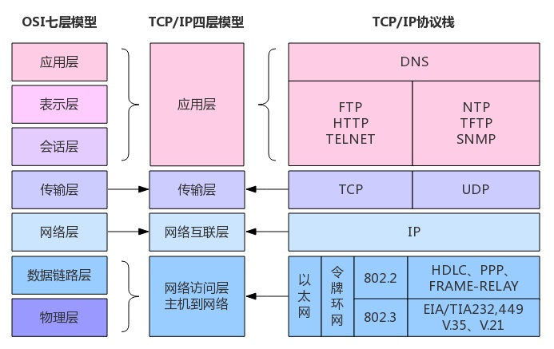

### DNS 简述

从浏览器输入 URL 之后，会发生什么？实际上，当你访问百度网站的网址 https://www.baidu.com 时，并无法直接根据站点名称访问到百度服务器。

网站地址又被称为 DOMAIN 域名，如果需要访问百度网站的服务器获取网页响应数据，则首先需要知道百度服务的确切 IP 地址。

DNS 全程为 DOMAIN NAME SYSTEM 域名解析系统，它实际上是网络拓扑中众多服务器中的其中一台。但有别于其他服务端机器，DNS 服务器主要提供的服务是将 DOMAIN 域名解析成确切的服务器 IP 地址。

所谓解析大多数情况下是通过映射表完成的，因为 DNS 服务器只是简单地存储了许多 DOMAIN 与 IP 之间的映射表。一般家庭网络会优先使用网络服务提供商的 DNS 服务器，来解析你所访问的目标网站的真实 IP。

但目标 DNS 服务器上也可能不存在指定域名为 KEY 的 VAL，即找不到对应的 IP 地址，一般造成这种情况多数是由于DNS 服务器中的解析记录过期导致的，其中涉及到 Time-To-Live 的概念。

TTL 指解析记录在 DNS 服务器中的缓存时间，如果记录过期了，那么 DNS 服务器中自然不存在对应的映射条目了。此时，目标 DNS 会会继续向上游的 DNS 服务器发起 DNS 解析请求，直到获取到真实 IP。

### TCP/IP 简述

常用的网络模型一般有两个：TCP/IP 模型和 OSI 参考模型。下图是它们的模型结构及相应层中存在的协议类型：

网络模型最上层是应用层，是平时用户最常接触到的一层，HTTP 协议就位于该层；最下层的物理层，是最接近硬件的一层，那里有常常听说的以太网协议。 

在 TCP/IP 模型中，应用层提供的服务相当于 OSI 模型的应用层、表示层和会话层的服务总和。不仅包含了管理通信连接的会话层功能、数据格式转换的表示层功能，还包括主机间交互的应用层功能。

应用层的目的是向应用程序提供网络接口，直接向用户提供服务。相比于下层的网络协议，应用协议要常见得多，可能大家都听过 HTTP 、HTTPS 、SSH 等应用层协议。

TCP/IP 模型中应用层位于传输层之上，传输层的端口号用于标识数据所对应的应用层协议。也就是说，有端口号的协议都是应用层协议。应用协议是终端设备之间的应用通信规则。应用之间交互的信息叫消息，应用协议定义这些消息的格式以及消息的控制或操作的规则。

计算机一般都有 65536 个端口，其中 1024 以下的端口号是系统端口。如果你的操作系统是 Linux，使用端口可能需要开启对于端口的权限。

一些常用的协议端口号如下：

- HTTP 端口号 80
- HTTPS 端口号 443
- SSH 端口号 22
- DNS 端口号 53

关于 HTTP 协议，一般都非常熟悉了。那什么是 HTTPS 协议呢？实际上 HTTPS 可以理解为 HTTP+SSL/TLS，即通过 SSL 或 TLS 证书来验证服务器的身份，并为浏览器和服务器之间的通信进行加密。

因为 HTTP 协议传输是明文传输，显然在现代网络中，明文传输是非常不安全的，而 HTTPS 的加密传输正好可以弥补这点不足。

PS：现在中间人攻击已经可以伪造 TLS 证书了，即传输还是可能被监听、解密。然后目前最新的传输层网络协议是 QUIC 协议了，有兴趣可以了解一下。

### 网站无法访问

关于这里无法访问的网站，指代的是 GitHub 这种技术向的、但国内访问较为困难的网站。网站无法访问时，如若不考虑网络连通性的问题，那么症结通常有以下几个。

#### DNS 污染/欺骗

DNS 污染是指一些刻意制造或无意中制造出来的域名服务器分组，把域名指往不正确的 IP 地址。它是一种让一般用户由于得到虚假目标主机 IP 而不能与其通信的方法，是一种 DNS 缓存投毒攻击。

DNS 污染发生在用户请求的第一步上，直接从协议上对用户的 DNS 请求进行干扰。简单来说，DNS 污染就是运营商对于你的 DNS 域名解析请求进行修改，以插入广告，或者让你无法访问某些网站，另外网速也会变慢。

#### DNS 劫持

DNS 劫持通过篡改 DNS 服务器上的数据返回给用户一个错误的查询结果来实现的，国内很多的 ISP（Internet Service Provider，中国移动、中国电信、中国联通等等）会故意修改自己 DNS 服务器上的记录，把某些敏感网站的记录修改成错误的 IP 地址。

通过劫持 DNS 服务器，可以取得域名解析记录的控制权，进而修改域名的解析结果。导致对该域名的访问由原 IP 地址转入到修改后的指定 IP，其结果就是对特定的网址不能访问或访问的是假网址，从而实现窃取资料或者破坏原有正常服务的目的。

#### IP 黑名单/敏感词过滤

关于 IP 黑名单和敏感词过滤都属于 GFW 防火墙的功能，有兴趣可以了解一下。

### 关于 no-resolve 选项

如果希望能够顺利访问 GitHub 网站，可以选择使用代理服务。代理软件通常会提供多种模式，其中不免会遇到规则模式。

规则模式下，代理软件允许用户使用规则列表，来灵活控制域名或 IP 是否使用代理服务。其中存在一项 IP 规则，它可以用于匹配 IP 的访问请求，借助本地 DNS 服务时，它也能匹配域名请求。

默认情况下 IP 规则不添加 no-resolve 选项，如果有未匹配域名遇到无 no-resolve 选项的 IP 规则，那么程序会使用本地 DNS 对域名进行解析，以获取对于的域名 IP 地址。如果为 IP 规则添加 no-resolve 选项，那么程序将不再使用本地 DNS 对未匹配域名进行解析。

以 MATCH 规则选用的模式，可将规则列表区分为黑名单模式和白名单模式：

- 黑名单模式：所有未匹配域名规则或 IP 规则的请求，最终都会选用直连模式（DIRECT）；
- 白名单模式：所有未匹配域名贵或 IP 规则的请求，都会选用代理模式（PROXY）。

一般的规则列表，其中包含的规则顺序为：1. 域名规则；2. IP 规则；3. MATCH 规则。

显然，是否在 IP 规则中添加 no-resolve 选项，影响的只有那些未能匹配域名规则的域名请求。换言之，只有未能匹配域名规则的域名请求，才会考虑是否需要使用 IP 规则的解析能力。

假设存在某个域名请求，它不匹配任何的域名规则，以黑、白名单模式区分，存在以下情况：

| 模式/域名属地 | 本地 DNS 能否解析 | 首次 IP 匹配 |                   是否添加 no-resolve 选项                   |
| :-----------: | :---------------: | :----------: | :----------------------------------------------------------: |
|  黑名单/国外  |       不能        | 国外 IP 规则 | 是，无法完成域名解析；否，存在 DNS 欺骗/污染或 DNS 泄露风险。 |
|  黑名单/国内  |        能         | 国内 IP 规则 |         是，能够完成域名解析；否，能够加快域名解析。         |
|  白名单/国外  |       不能        | 国外 IP 规则 | 是，能够加快域名解析；否，存在 DNS 欺骗/污染或 DNS 泄露风险。 |
|  白名单/国内  |        能         | 国内 IP 规则 |         是，有封号或其它风险；否，能够完成域名解析。         |

其中，**本地 DNS 能否解析**一栏并非百分百概率解析，它仅指代本地 DNS 服务器能否够大概率解析出域名的真实 IP 地址，原因是域名解析需要考虑 DNS 污染或 DNS 服务器是否在线等情况。

有两种情况不是很好理解，即黑名单或白名单下，访问国外网址且无 no-resolve 选项：

- DNS 欺骗/污染：这种情况是及其正常的，本地 DNS 服务器通常会返回一个错误的 IP 地址，导致无法访问；
- DNS 泄露：从概率的角度出发，本地 DNS 是有可能将国外域名正确地解析出来，且同时能够对其发起正常的访问请求，但这会 DNS 泄露。

根据以上表格，为避免不必要的风险，可以得出黑、白名单下理论最优的 no-resolve 选项使用方式：

- 国外 IP 规则需添加 no-resolve 选项，国内 IP 规则不需要添加 no-resolve 选项。

但真实情况是 IP 规则为混合使用，域名会自上而下地顺序匹配 IP 规则，这很可能会导致一种情况：**某些国外域名在不希望进行 DNS 解析时，优先匹配到了一条没有添加 no-resolve 选项的国内 IP 规则，从而导致 DNS 欺骗/污染或 DNS 泄露。**

### IP 规则最优实现

实际最优的 no-resolve 选项使用方式为：

- 选择黑名单模式，仅添加国外 IP 规则，且该规则需要添加 no-resolve 选项。

白名单模式下，没有最优的 no-resolve 选项使用方式。对于国内 IP 地址而言，如果必须保证大概率不存在封号或其它风险，那么国内 IP 规则就必需存在且不能添加 no-resolve 选项。换言之国外域名未匹配时，它被本地 DNS 解析几乎是必然发生的。

如果不在乎 DNS 是否泄露，那么就尽可能将不带 no-resolve 选项国内的 IP 规则添加到规则中，但即便如此也无法保证不出现封号或其它风险。

可以根据需求在黑名单模式的前提下，将带有 no-resolve 选项的国外 IP 规则置于 IP 规则之前，而将不带 no-resolve 选项的国内 IP 规则置于 IP 规则之后。

因为黑名单模式下，仅添加国外 IP 规则相当于衔接 MATCH 规则，如果前者无匹配，那么 MATCH 规则中也会需要使用本地 DNS 解析域名。所以是否在国外 IP 规则之后、MATCH 规则之前，添加不带 no-resolve 选项的国内 IP 规则，在黑名单模式下是可选的。

而以上可选方案，也是目前最适用于白名单模式的规则排布。

通过灵活控制 MATCH 规则选用 DIRECT 模式还是 PROXY 模式，可以让黑、白名单模式实现切换：

- 黑名单下，MATCH 规则使用 DIRECT 模式；
- 白名单下，MATCH 规则使用 PROXY 模式。
