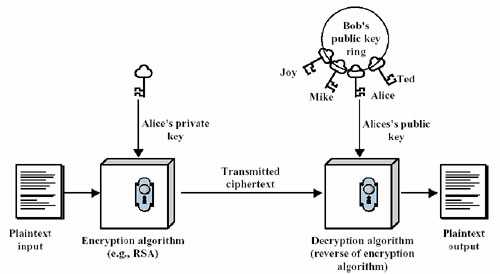

### 加密与认证

加密是使用特殊的方式将数据资料进行编码，使得非法用户即时取得该加密信息，也无法获取真正的资料内容。因此数据加密可以保护数据，防止监听攻击等。其重点在于数据的安全性。

认证多指的是身份认证，它用来判断某个身份的真实性。身份通过认证后，系统才可以依照不同的身份，给予不同的权限。其目的在于鉴别用户的真实性。

### 公钥与私钥

在现代密码体系中，加密和解密是采用不同的密钥分别进行的，也就是俗称的非对称密钥密码系统，它所采用的是非对称加密算法（RSA）。每个通信方均需要两个密钥，即公钥与私钥，这两把密钥可以互为加解密。

公钥是公开的，不需要保密；而私钥是由个人持有的，必须妥善保管与保密。

公钥与私钥的原则：
1. 一个公钥对应一个私钥；
2. 密钥对中，让大家都知道的是公钥；不能公开的、只有自己知道的是私钥；
3. 如果用其中一个密钥对数据进行加密处理，则必定只有对应的另一个密钥才能对数据进行解密处理；
4. 如果用其中一个密钥可以对数据进行解密，则该数据必然是对应着另一个密钥所进行加密的。

非对称密钥密码的主要应用，就是**公钥加密**和**公钥认证**，而公钥加密的过程和公钥认证的过程是不一样的。

### 基于公钥的加密过程

假如有两个用户 Alice 和 Bob，Alice 需要把一段明文，通过双钥加密技术发送给 Bob，Bob 有一对公钥和私钥，那么加密、解密的过程如下：
1. Bob 将他的公钥传送给 Alice；
2. Alice 使用 Bob 的公钥加密她的消息，并传送给 Bob；
3. Bob 使用他的私钥解密 Alice 的消息。


### 基于公钥的认证过程

认证的过程不同于加密，主要用于鉴别用户的真伪。只需要鉴别一个用户的私钥是正确的，就可以鉴别这个用户的真伪。

假如仍然有两个用户 Alice 和 Bob，Alice 需要让 Bob 知道自己是 Alice，而不是假冒的。因此 Alice 需要使用自己的私钥对文件进行签名，并发送给 Bob，Bob使用 Alice 的公钥对文件进行解密，如果解密成功，则证明 Alice 的私钥是正确的，从而完成了对 Alice 的身份认证。认证过程如下：
1. Alice 使用私钥对文件进行加密，从而对文件进行签名；
2. Alice 将签名的文件传送给 Bob；
3. Bob 使用 Alice 的公钥解密文件，从而验证签名。




### SSH 秘钥对的生成

使用 SSH 可以生成一对公钥和私钥的，例如 Git 中自带的 ssh-keygen 就可以使用以下命令创建公钥和私钥：

```bash
ssh-keygen -o
```

该命令会在 ~/.ssh 目录下生成两个文件 id_dsa、id_dsa.pub，其中 id_dsa 为私钥文件，id_dsa.pub 为公钥文件。

某些网络支持 SSH 连接，你就可以将公钥上传到指定服务器，将私钥保存在本地用于连接服务器以完成认证身份的操作了。

例如 GitHub 或 Gitee 就支持 SSH 连接，只需要将公钥按指定的方式上传到网站的服务器中，用户就可以使用私钥对文件进行签名并传送到它们的服务器进行用户认证。同样地，GitHub 或 Gitee 服务器也可以使用你的公钥对数据进行加密传输到用户的设备上，用户可以使用私钥对加密数据进行解密。

### 疑难梳理

关于公钥和私钥的使用，你会发现无论是公钥还是私钥实际上都能应用在加解密文档上。那是不是实际上公钥和私钥是没有区别的？答案是否定的。

对于非对称加密，公钥和私钥的加解密过程是不一样的。因此类似一些支持 SSH 的服务器，它们仅仅支持公钥加解密。这意味着即使你可以将你的私钥上传到服务器上，服务器也不能够使用你的私钥对文件进行加解密，因为服务器使用私钥加解密时，必然会出现在流程上的加解密错误。

同样的，从开发者角度出发，公钥和私钥的区分是十分有必要的。这意味着对于加解密流程来说，你的服务仅仅需要编写一套针对公钥加解密的代码即可。

私钥对于非对称加密来说是十分重要且不可外泄的，私钥的持有对象可以说是有且仅有你自己，但公钥则可以给许多其他的人持有，这实际上很贴合私钥与公钥的命名逻辑。

对于非对称加密来说，你不必要了解公私钥加解密的流程。只要是非对称加密且加解密使用的算法一致，那么加解密的过程必然是固定不变且不可能出错的。