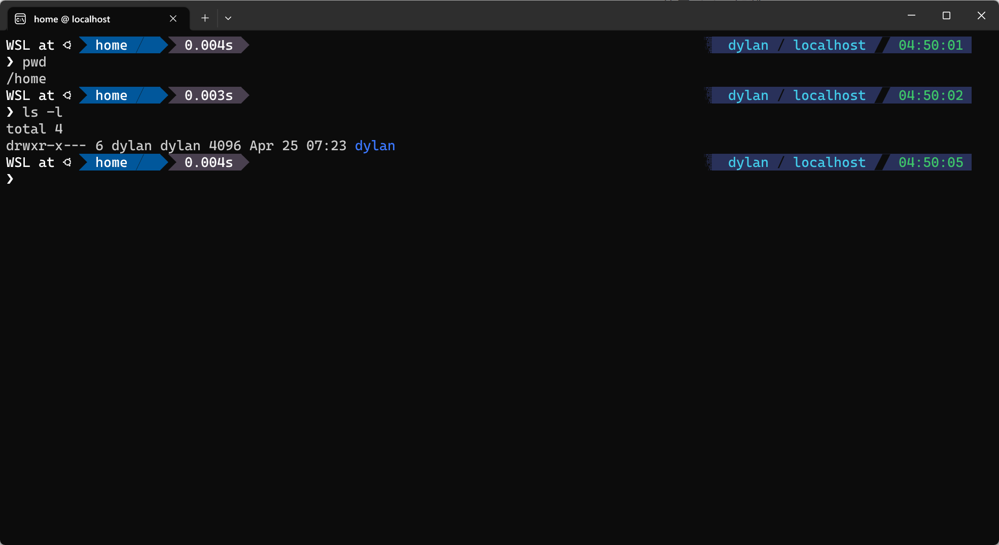
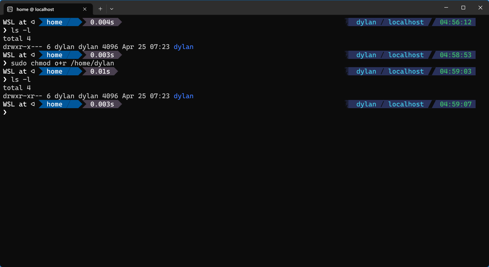
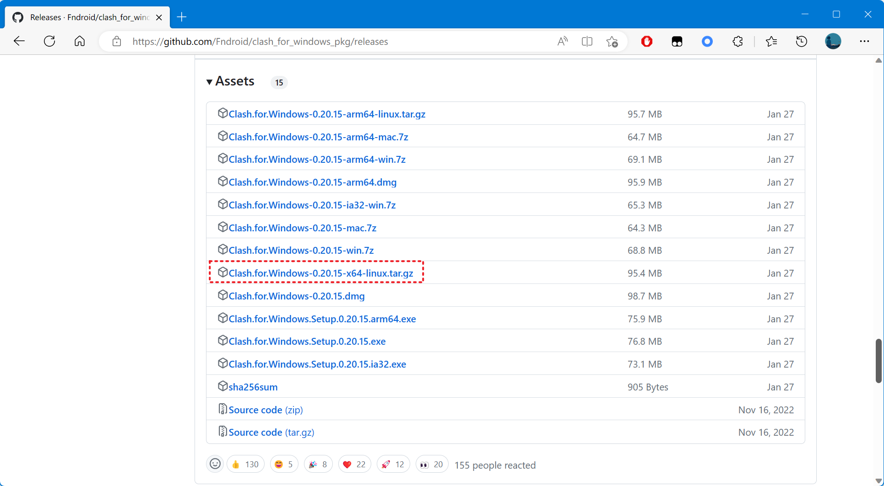
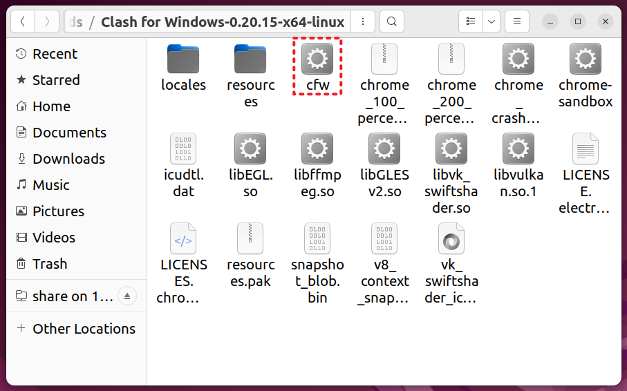
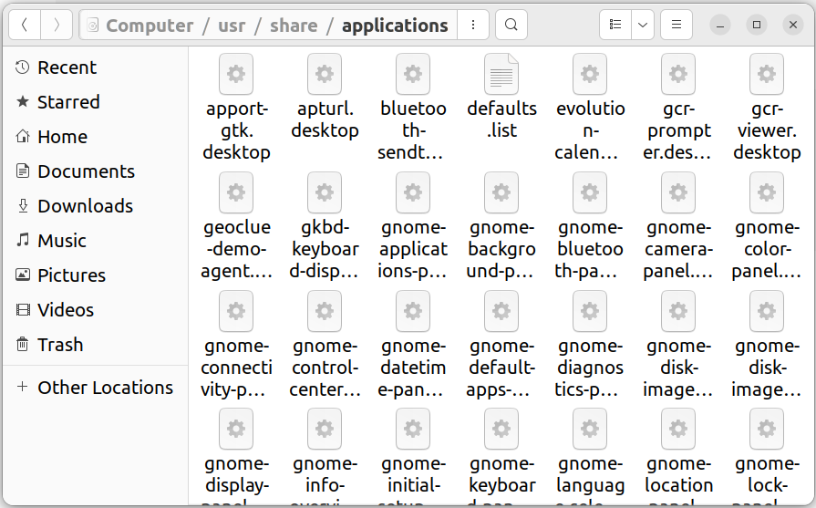
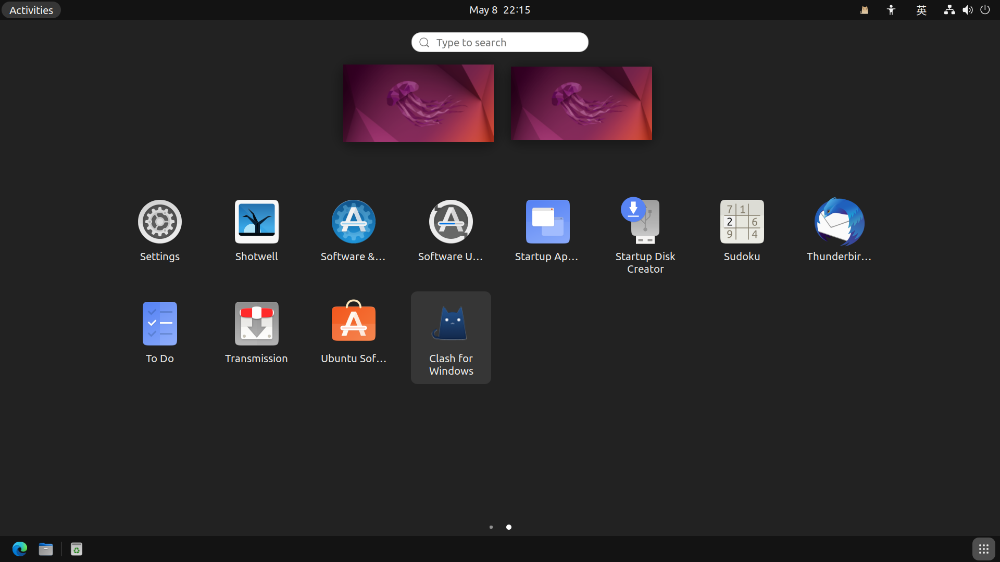

### 概述

本篇记录 Ubuntu 22.04.2 系统在 VMware Workstation 16 中的安装与配置过程。

### 原因

对于安装过虚拟机系统的人来说，应该都知道虚拟机快照的重要性。快照能够在虚拟机系统意外崩溃时，提供迅速恢复系统的途径，从而避免大费周章地重装系统。

除此之外，快照的另一个用途是保存当前对虚拟机系统作出的配置。如果说重装系统是一件折磨人的事情，那么配置系统简直可以算得上顶级折磨。

如果是从头开始部署一个新的虚拟机系统呢？显然安装系统是非常简单，相较之下配置系统才是最困难、最花费时间的部分，运气不好可能需要花上几天的时间。

为了便于快速部署一个简单的虚拟机环境，记录系统的安装与配置过程是十分必要的。

### 环境配置

- VMware Workstation 16 Pro（16.2.3 build-19376536）
- Ubuntu 22.04.2（ubuntu-22.04.2-desktop-amd64）

### 注意事项

使用 VMware Workstation 安装虚拟机时，有几点注意事项：

- 新建虚拟机向导中，安装客户机操作系统推荐选择“稍后安装操作系统”，后续在虚拟机设置中可以手动添加安装程序的光盘映像 .iso 文件；
- 新建虚拟机向导中，指定磁盘容量时选择“将虚拟磁盘拆分成多个文件”，这样方便虚拟机文件的移动和保存；
- 虚拟机设置中网络适配器选择 NAT 模式（默认模式），这样虚拟机的网络不容易出错；

如果本地网络构成并不特殊，网络适配器还可以选择桥接模式（BRIDGE）。但一定切记不能使用仅主机模式（Host-Only）。仅主机模式下，虚拟机只能和主机通信，无法访问外界网络。

### 安装过程

对于 Ubuntu 22.04.2 来说，安装它的桌面版系统并不复杂，安装过程中基本一直点击确认即可完成系统安装。除了期间需要设置用户名密码外，没什么特别需要留意的地方：


一些推荐设置：

- 选择全英系统。该系统一定不是主用系统，为了能在使用终端时更加地便捷，推荐使用全英显示。大概没有人会想在终端英文字符路径中，掺杂地输入几个中文字符；
- 选择位置时，点击地图或手动输入以选择 Shanghai（GMT+8）。这关乎于系统时间，而系统时间十分重要，稍有偏差都会导致网络无法正常访问。


### 系统配置

该部分仅针对的 Ubuntu 22.04.2 桌面系统，主要包括系统更新、密码变更、显示设置、输入程序及字体安装等比较基础，但却重要的配置。

#### 安装更新

首次进入 Ubuntu 系统时，如果网络没有故障，那么软件更新器会自动弹出询问是否更新：


Software Updater（以前名为 Update Manager）是一个可选的应用程序，它用于升级所有已知来源的 DEB 包，同时还包含内核更新，推荐安装。

如果在此前的安装过程中选择定位在中国，那么软件更新器会自动将软件更新源设置为中国服务器，这意味着可以在上述提示窗口出现时，直接选择“现在安装”。


但如果没有定位在中国，则需要先更改位置信息以确保系统时间是正确的。随后在软件更新器中把中国服务器设置为下载源，例如将阿里源设置为下载源：


选择好下载源后，点击 Close 保存设置。后续打开 Software Updater 软件执行更新即可。

#### 密码变更

Ubuntu 22.04.2 系统的安装过程中，并不要求设置 root 账户密码。默认情况下，系统 root 账户的密码是随机的，这意味着每次重启系统后，该密码都会被重置。

如果需要登录并使用 root 账户，则先需要使用命令修改一次当前普通用户的密码：

```bash
sudo passwd
```

修改后的密码将会作为 root 账户的固定密码，之后 root 账户密码将不再随机生成。

如果新密码长度短于 8 位，终端会出现提示信息：

```
BAD PASSWORD: The password is shorter than 8 characters
```

但这并不表示密码不能使用，继续重复输入密码即可修改。

#### 输入程序

如果安装时选择了英文系统，那么默认不存在中文输入法（或无用）。

启用中文输入法，需要进入 Region & Language 设置中，选择 Manage Installed Languages。首次进入管理已安装的语言时，会自动出现“受支持语言尚未完整安装”的提示：


点击 Install 等待语言支持程序执行完毕，之后重启系统。

注销/重启系统后，在设置中找到 Keyboard 选项，找到 Input Sources 添加其他的输入源：


选择 Chinese 中的 Chinese (Intelligent Pinyin) 选项：


之后将默认的 Hanyu Pinyin (with AltGr dead keys)/English (US) 或其他首选输入源删除：


注销/重启系统后，中文输入法会默认启用。

### 软件管理

本小节介绍一些 Ubuntu 22.04.2 系统中基础的、用于管理的命令。

#### 软件格式

Ubuntu 默认支持的软件包有两种格式：.deb 格式的软件包和 .snap 格式的软件包。用于安装部署这些软件包的程序，就是软件包管理系统（Package Manager）。

软件包管理系统是在电脑中自动安装、配置、卸载和升级软件包的工具组合，在各种系统软件和应用软件的安装管理中均有广泛应用。

Ubuntu 中管理 deb 软件包的有 dpkg 软件包管理系统及其前端 APT 软件包管理系统，所谓“前端”可以理解为更高级的意思；其次管理 sanp 软件包的是 Snappy 软件包管理系统，不常使用。

这里需要了解一个关于 .deb 格式软件包的知识点：每个 .deb 格式软件包都具有唯一的 PACKAGE 属性，其对应的值为该 DEB 软件包的包名。

以 Microsoft Edge 浏览器的 .deb 格式软件包为例：

- microsoft-edge-stable_112.0.1722.58-1_amd64.deb

以下命令用于查看软件包详情：

```bash
sudo dpkg -I microsoft-edge-stable_112.0.1722.58-1_amd64.deb
```

终端将输出软件包信息：

```
new Debian package, version 2.0.
 size 142150282 bytes: control archive=6472 bytes.
    1157 bytes,    12 lines      control              
   13128 bytes,   411 lines   *  postinst             #!/bin/sh
    8283 bytes,   269 lines   *  postrm               #!/bin/sh
    1354 bytes,    42 lines   *  prerm                #!/bin/sh
 Package: microsoft-edge-stable
 Version: 112.0.1722.58-1
 Architecture: amd64
 Maintainer: Microsoft Edge for Linux Team <EdgeLinuxDev@microsoft.com>
 Installed-Size: 493101
 Pre-Depends: dpkg (>= 1.14.0)
 Depends: ca-certificates, fonts-liberation, libasound2 (>= 1.0.17), libatk-bridge2.0-0 (>= 2.5.3), libatk1.0-0 (>= 2.2.0), libatspi2.0-0 (>= 2.9.90), libc6 (>= 2.17), libcairo2 (>= 1.6.0), libcups2 (>= 1.6.0), libcurl3-gnutls | libcurl3-nss | libcurl4 | libcurl3, libdbus-1-3 (>= 1.9.14), libdrm2 (>= 2.4.75), libexpat1 (>= 2.0.1), libgbm1 (>= 17.1.0~rc2), libglib2.0-0 (>= 2.39.4), libgtk-3-0 (>= 3.9.10) | libgtk-4-1, libnspr4 (>= 2:4.9-2~), libnss3 (>= 2:3.31), libpango-1.0-0 (>= 1.14.0), libu2f-udev, libuuid1 (>= 2.16), libvulkan1, libx11-6 (>= 2:1.4.99.1), libxcb1 (>= 1.9.2), libxcomposite1 (>= 1:0.4.4-1), libxdamage1 (>= 1:1.1), libxext6, libxfixes3, libxkbcommon0 (>= 0.5.0), libxrandr2, wget, xdg-utils (>= 1.0.2)
 Provides: www-browser
 Section: web
 Priority: optional
 Description: The web browser from Microsoft
  Microsoft Edge is a browser that combines a minimal design with sophisticated technology to make the web faster, safer, and easier.
```

从输出信息中可以看到软件包的 PACKAGE 属性，及其对应的属性值：

- micorsoft-edge-stable

Ubuntu 多数情况下会选择 APT 或 dpkg 软件包管理系统来管理软件，因为大多数软件仅提供 .deb 格式的软件包。虽然它们都用于管理 .deb 格式软件包，但其实际的管理方式有所不同。

APT 软件包管理系统依赖于**源**，可以把**源**理解为当前所有可供使用的 .deb 格式软件包合集的远程仓库，APT 会在本地维护一份该远程仓库中所有软件包的 PACKAGE 属性值列表。

用户使用 APT 安装软件时，只需要提供软件的 PACKAGE 属性值，APT 会在本地属性值列表中查询该值，如果存在对应记录，则从远程仓库（**源**）中下载对应的 .deb 格式软件包执行安装。

APT 本质上是 dpkg 的前端，简单来说就是 APT 提供比 dpkg 更多且更高级的功能，正因如此 dpkg 会显得比较“原始且古老”。

“原始” 的 dpkg 软件包管理系统因此也并不依赖于软件包的 PACKAGE 属性值，或者说它不具备检索 PACKAGE 属性值这些“花里胡哨”的功能，dpkg 总是直接管理 .deb 格式的软件包。

#### 安装软件

APT 和 dpkg 出于管理软件包形式的差别，使用它们安装软件时所需提供的目标参数是不同的。

其中：

- ${deb_package_name}：PACKAGE 属性值
- ${deb_package_fileName}：目标 .deb 格式软件包的文件名

使用 APT 安装软件的命令为：

```bash
sudo apt install ${deb_package_name}
```

使用 dpkg 安装软件的命令为：

```bash
sudo dpkg -i ${deb_package_fileName}
```

以 Microsoft Edge 浏览器为例：

- microsoft-edge-stable_112.0.1722.58-1_amd64.deb

假设 APT 源中存在 PACKAGE 属性值为 micorsoft-edge-stable 的 .deb 格式软件包，那么 APT 和 dpkg 安装该软件的命令分别如下：

```bash
sudo apt install micorsoft-edge-stable
sudo dpkg -i microsoft-edge-stable_112.0.1722.58-1_amd64.deb
```

可以看到，使用 APT 时需要提供的参数是目标软件的 PACKAGE 属性值，使用 dpkg 时需要提供的是目标 .deb 软件包的文件名。

另外，还有一种不推荐的安装方式。因为 APT 是 dpkg 的前端，它实际上支持直接管理 .deb 包：

```bash
sudo apt install ${deb_package_fileName}
```

但执行该命令很可能出现访问权限等问题，例如 Permission denied，后续将说明此问题。

#### 软件依赖

任何程序都逃不开依赖问题，类比 Java 中 JAR 包之间存在的依赖关系，Linux 系统中软件包之间也同样存在依赖关系。

例如，软件 A 依赖于软件 B。这意味着安装软件 A 的时候，必须保证系统上已安装了软件 B。

软件之间的依赖关系，在使用 APT 软件包管理系统时并不明显，因为 APT 能够自动解决软件依赖缺失的问题。类比 Java 项目中使用项目管理工具 Maven 能将关联 JAR 包依赖自动引入项目一般，APT 也会在软件存在依赖缺失时，自动将缺失的依赖安装到系统中。

但 dpkg 管理系统不具备解决依赖缺失的能力，如果使用 dpkg 安装的软件包存在依赖缺失的情况，那么系统会提示依赖缺失并将安装回滚，缺失的依赖会以列表的形式输出在终端上。

Ubuntu 中可以借助 APT 来解决 dpkg 安装软件时遇到的依赖缺失：

```bash
sudo apt -f install -y
```

以上命令仅负责安装缺失依赖，后续仍旧需要再次使用 dpkg 来重新安装目标软件。

#### 权限问题

使用 APT 命令直接管理 .deb 软件包时，可能出现权限问题。以安装 Microsoft Edge 浏览器为例：

```bash
sudo apt install microsoft-edge-stable_112.0.1722.58-1_amd64.deb
```

虽然一般情况下，软件能够安装成功（Microsoft Edge 浏览器所需的依赖，当前系统中都已具备），但大概率终端仍会出现以下提示信息：

```
N: Download is performed unsandboxed as root as file '/home/dylan/microsoft-edge-stable_112.0.1722.58-1_amd64.deb' couldn't be accessed by user '_apt'. - pkgAcquire::Run (13: Permission denied)
```

这通常是访问权限不足所导致的。

使用桌面版 Ubuntu 系统时，下载好的 .deb 格式软件包通常位于 /home/dylan/Download 目录，以上例子中软件包挪动到了 /home/dylan 目录下，但不影响提示信息的复现。

使用 APT 安装软件时，它会使用一个内建账户 _apt 来完成软件依赖的下载，这个 _apt 用户于当前用户来说属于“其它用户（Other Users）”。

默认情况下，当前用户的家目录并不对其它用户开放 read 权限：



因此直接使用 APT 命令安装位于家目录下的 .deb 软件包时，大概率会出现拒绝访问的错误。

有两种方法可以消除这个提示：

1. 将 .deb 包挪动到其它用户可访问的目录中，再执行安装；
2. 更改家目录于其他用户的访问权限。

推荐使用第一种方法。如果需要更改家目录的访问权限，使用以下命令：

```bash
sudo chmod o+r /home/dylan
```

它的意思是为所有其他用户赋予目标目录的 read 权限：



一般不推荐以更改家目录访问权限的方式，去解决 APT 安装软件时出现的提示。相反，直接将软件包置于可被其他用户访问的目录下会更好，这样可以避免目录权限的紊乱。

#### 卸载软件

不论使用的是 APT 管理系统还是 dpkg 管理系统，卸载软件的参数均为软件的 PACKAGE 属性值。

使用 APT 卸载软件的命令为：

```bash
sudo apt remove ${deb_package_name}
```

使用 dpkg 卸载软件的命令为：

```bash
sudo dpkg -r ${deb_package_name}
```

推荐使用 APT 来完成软件的卸载，因为多数情况下 dpkg 提供的功能并不完善。虽然以上命令均不会将其他无用的依赖一并移除，但前者 APT 还额外提供了其他的卸载命令，用于同时移除无用依赖。

希望卸载软件时一并将无用的依赖移除，可以使用以下命令：

```bash
sudo apt autoremove ${deb_package_name}
```

以上命令在不添加任何参数时，可以单独用于移除系统中的无用依赖：

```bash
sudo apt autoremove
```

快捷查看当前系统中所有的无用依赖，可以使用以下命令：

```
sudo apt autoremove --assume-no
```

#### 使用建议

关于软件安装：

- 如果源中不存在某款软件，但本地拥有 .deb 格式软件包，则建议使用 dpkg 直接安装，并配合 APT 命令解决可能存在的依赖问题；
- 如果源中具备该目标软件，则建议直接使用 APT 进行安装。

关于软件卸载，建议统一使用 APT 软件管理系统完成卸载操作：

- 因为无论源中是否存在目标 .deb 软件包，软件都是具备唯一的 PACKAGE 属性值，这意味着已安装的软件也总是能够通过 PACKAGE 值进行检索；
- 移除软件的过程中，APT 提供了移除无用依赖的功能，能够更加深度地将无用数据清除。

#### 查找软件

以下命令用于查看所有使用 APT 或 dpkg 管理的、已安装或未安装的软件列表命令：

```bash
sudo apt list
```

该命令通常会配合 grep 命令一起使用，用于查找目标软件是否存在于源或系统中。例如：

```bash
sudo apt list | grep microsoft-edge
```

假设终端输出如下：

```bash
microsoft-edge-beta/stable 113.0.1774.35-1 amd64
microsoft-edge-dev/stable 114.0.1823.7-1 amd64
microsoft-edge-stable/stable,now 113.0.1774.35-1 amd64 [installed]
```

其中，末位具有 [installed] 表示该软件已安装，其余则为存在于源中且未安装的软件。

除此之外，list 命令实际支持精确查找：

```bash
sudo apt list vim
```

终端输出大致如下：

```
vim/jammy-updates,jammy-security 2:8.2.3995-1ubuntu2.7 amd64
vim/jammy-updates,jammy-security 2:8.2.3995-1ubuntu2.7 i386
```

但该方式只适用于全词匹配，例如上述例子中是精确查找 vim 软件包，如果将命令更改为：

```bash
sudo apt list vi
```

则不会得到任何的搜索结果，因为该命令不支持模糊查找，同时源中也不存在 PACKAGE 属性值为 vi 的任意软件包。

如果只想所有已安装的软件列表，可以加上 \--installed 参数：

```bash
sudo apt list --installed
```

注意，list 命令的输出结果一般不利于阅读，建议配合 more、less 或 most 等阅读工具一起使用，或者直接使用 grep 命令对输出结果进行筛选。

图形化界面的 Ubuntu 22.04.2 系统中，一般预装了 Firefox 浏览器，但尝试使用终端查询时：

```bash
sudo apt list -i | grep firefox
```

会发现没有输出任何结果。

这是因为 Firefox 浏览器并不是使用 APT 或 dpkg 进行管理，取而代之它使用 snap 软件系统。想要查看所有使用 snap 系统进行管理的软件，可以使用以下命令：

```bash
sudo snap list
```

终端会以列表的形式给出所有的软件详情：

```
Name                       Version           Rev    Tracking         Publisher   Notes
bare                       1.0               5      latest/stable    canonical✓  base
core20                     20230308          1852   latest/stable    canonical✓  base
core22                     20230325          607    latest/stable    canonical✓  base
firefox                    110.0-3           2356   latest/stable/…  mozilla✓    -
gnome-3-38-2004            0+git.6f39565     137    latest/stable/…  canonical✓  -
gnome-42-2204              0+git.e7d97c7     87     latest/stable    canonical✓  -
gtk-common-themes          0.1-81-g442e511   1535   latest/stable/…  canonical✓  -
snap-store                 41.3-66-gfe1e325  638    latest/stable/…  canonical✓  -
snapd                      2.58.2            18357  latest/stable    canonical✓  snapd
snapd-desktop-integration  0.1               57     latest/stable/…  canonical✓  -
```

可以看到 Firefox 浏览器位于该列表中。更多关于 snap 命令的使用方式，请查阅帮助：

```bash
sudo snap help
```

#### 更新升级

本地维护的软件源列表一般需要手动更新，以下命令用于更新本地软件源数据库（列表）：

```bash
sudo apt update
```

以下命令用于升级系统中所有已安装的软件版本：

```bash
sudo apt upgrade
```

如果希望查看可升级的软件，可以使用以下命令：

```bash
sudo apt list --upgradable
```

#### 软件详情

在软件格式小节中，提及了可以使用 dpkg 管理系统命令，直接查看 .deb 格式软件包的软件详情。以 Microsoft Edge 浏览器为例：

- microsoft-edge-stable_112.0.1722.58-1_amd64.deb

命令如下：

```bash
sudo dpkg -I microsoft-edge-stable_112.0.1722.58-1_amd64.deb
```

如果希望查看 APT 源中的某个软件包详情，可以使用 show 命令，但需要提供软件的 PACKAGE 属性值。例如 vim 软件的 PACKAGE 属性值为 vim，查看该软件包详情的命令如下：

```bash
sudo apt show vim
```

终端将输出 vim 软件的详情：

```
Package: vim
Version: 2:8.2.3995-1ubuntu2.7
Priority: optional
Section: editors
Origin: Ubuntu
Maintainer: Ubuntu Developers <ubuntu-devel-discuss@lists.ubuntu.com>
Original-Maintainer: Debian Vim Maintainers <team+vim@tracker.debian.org>
Bugs: https://bugs.launchpad.net/ubuntu/+filebug
Installed-Size: 4,017 kB
Provides: editor
Depends: vim-common (= 2:8.2.3995-1ubuntu2.7), vim-runtime (= 2:8.2.3995-1ubuntu2.7), libacl1 (>= 2.2.23), libc6 (>= 2.34), libgpm2 (>= 1.20.7), libpython3.10 (>= 3.10.0), libselinux1 (>= 3.1~), libsodium23 (>= 1.0.14), libtinfo6 (>= 6)
Suggests: ctags, vim-doc, vim-scripts
Homepage: https://www.vim.org/
Task: cloud-image, ubuntu-wsl, server, ubuntu-server-raspi, lubuntu-desktop
Download-Size: 1,728 kB
APT-Sources: http://mirrors.aliyun.com/ubuntu jammy-updates/main amd64 Packages
Description: Vi IMproved - enhanced vi editor
 Vim is an almost compatible version of the UNIX editor Vi.
 .
 Many new features have been added: multi level undo, syntax
 highlighting, command line history, on-line help, filename
 completion, block operations, folding, Unicode support, etc.
 .
 This package contains a version of vim compiled with a rather
 standard set of features.  This package does not provide a GUI
 version of Vim.  See the other vim-* packages if you need more
 (or less).
```

#### 安装位置

软件的安装位置通常由软件包制作者决定，软件安装后可查看软件的安装位置信息：

```bash
sudo dpkg -L ${deb_package_name}
```

上述命令会将所有与软件关联的目录列出来。

### 个性配置

以下是可选的配置。

#### 显示设置

Ubuntu 22.04.2 桌面系统中采用 GNOME 42.5 桌面环境，它默认使用 Wayland 通讯协议。


但目前 Ubuntu 22.04.2 上的 Wayland 协议存在一定的问题，具体表现在系统进行分辨率缩放时，如果缩放比例不为 100%，那么所有非原生的系统应用都会出现界面模糊的问题。


如果有放大系统全局字体大小的需求，如放大系统窗口显示字体或终端显示字体，那么不建议在显示设置中直接改变缩放比率！

这里推荐使用辅助功能里提供的调整系统字体大小选项：


如果希望字体以自定义的比例放大，例如让字体放大 1.4 倍，可以直接在终端运行以下命令：

```bash
gsettings set org.gnome.desktop.interface text-scaling-factor 1.4
```

直接使用命令时，会同时开启放大字体的功能，免去打开设置等操作。

如果任务栏图标在字体改变大小之后显得过小，可以在外观（Appearance）中修改它的大小：


#### 字体安装

Ubuntu 22.04.2 支持 Windows 系统的字体格式，将 .ttf 字体文件放在 ~/home/.fonts 目录下，系统将自动识别这些字体。

#### 代理服务

图形化界面的 Ubuntu 22.04.2 系统下，可以使用 [Clash for Windows](https://github.com/Fndroid/clash_for_windows_pkg) 软件开启代理服务，该软件提供的 TUN Mode 可以实现系统网络的全局代理。

TUN 模式依赖于劫持 53 端口的流量，但 Ubuntu 系统中的 53 端口默认被 systemd-resolved 服务占用，这种情况下不仅自定义的 DNS 服务器无法起作用，TUN 模式代理亦无法起作用。

可以通过命令行查看 53 端口的占用情况：

```bash
sudo lsof -i :53
```

该端口一般默认被 systemd-resolved 占用，终端可以看到以下输出：

```
COMMAND    PID            USER   FD   TYPE DEVICE SIZE/OFF NODE NAME
systemd-r 2263 systemd-resolve   13u  IPv4  37999      0t0  UDP localhost:domain 
systemd-r 2263 systemd-resolve   14u  IPv4  38000      0t0  TCP localhost:domain (LISTEN)
```

修改 systemd-resolved 的配置文件：

```bash
sudo vi /etc/systemd/resolved.conf
```

将 resolved.conf 配置的 DNSStubListener 键值对注释去掉，并将值修改为 no：

```
DNSStubListener=no
```

注意，如果未在网络配置中设置自定义的 DNS 服务器，那么还需要在以上配置中添加 DNS 的信息。

保存配置后重启 systemd-resolved 服务：

```bash
sudo systemctl restart systemd-resolved.service
```

再次检查端口占用情况：

```bash
sudo lsof -i :53
```

能够发现终端没有输出，即 53 端口已不再被 systemd-resolved 服务占用。

Ubuntu 22.04.2 系统下建议使用 Clash for Windows 0.20.15 版本，该版本目前较为稳定。新版可能会存在某些不可预知的问题，但多数问题在 Clash for Windows 项目的 issues 里能找到解决方法。

Clash for Windows 适配 Linux 的 Releases 是一个普通的压缩包，解压后即可使用：



将压缩包下载后，可以右键解压到任意目录，或使用命令行解压：

```bash
sudo tar zxvf Clash.for.Windows-0.20.15-x64-linux.tar.gz
```

解压缩后，找到其中 cfw 程序，它即为 linux 下的“可执行程序”：



双击 cfw 即可打开 Clash for Windows 的 GUI 界面。

关于 Clash for Windows 基本配置，请参考：[Clash for Windows](./Workspace Config.md/####Clash for Windows)。

#### 快捷方式

使用过 Windows 系统的都知道在该系统下，创建某个可执行程序的快捷方式，只需要右键选择“创建快捷方式”即可。但在 Linux 中，创建程序的快捷方式并没有那么 Windows 系统下来得简单。

Ubuntu 桌面系统的快捷方式一般存放在 /usr/share/application 路径下：



如果需要为某个程序添加快捷方式，则需要将快捷方式配置到该目录中，配置命名需要以 .desktop 为后缀。例如 Clash for Windows 程序的快捷方式：

```
[Desktop Entry]
Name=Clash for Windows
Exec="/lib/clash.for.windows/cfw"
Icon=/lib/clash.for.windows/logo_64.png
Terminal=false
Type=Application
```

注意，这里的程序图标需要自行放入到 /lib/clash.for.windows 目录中。将配置命名为 clash.desktop 并保存到 /usr/share/application 目录中，菜单中就会出现对应快捷方式的图标：

