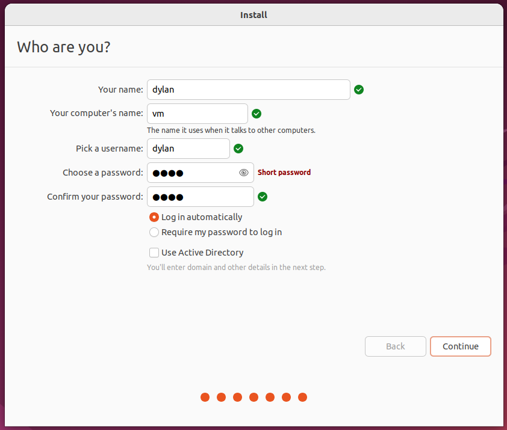
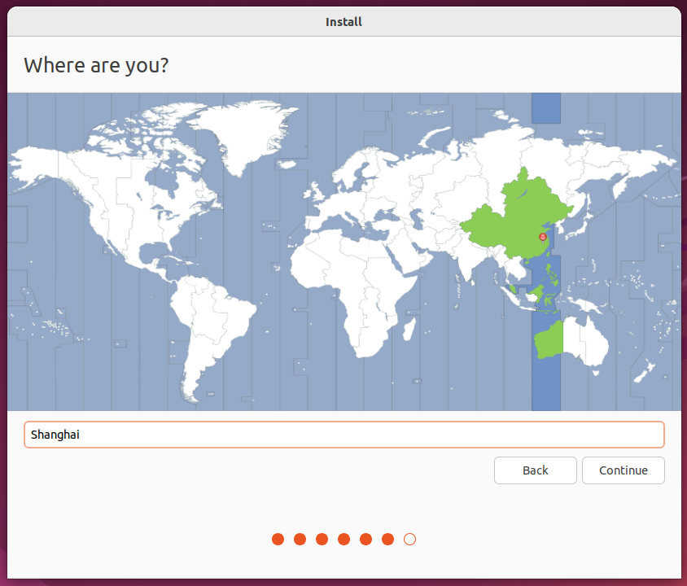
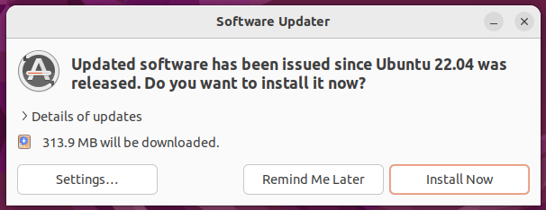
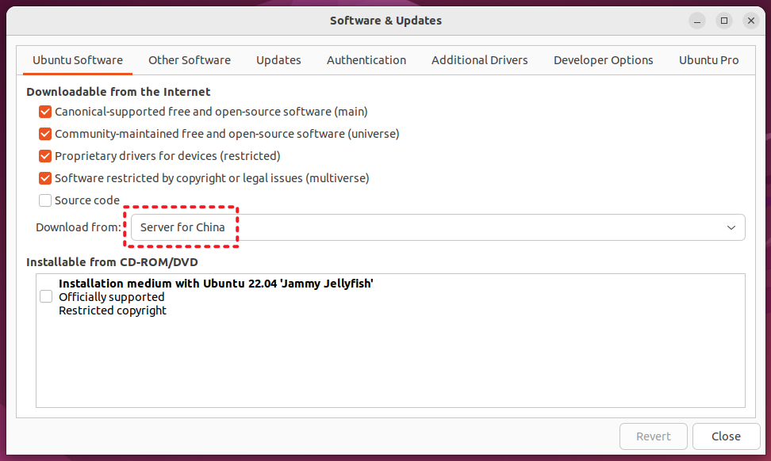
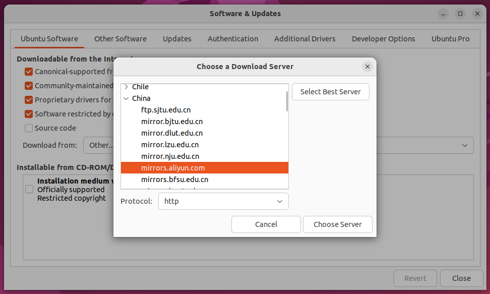
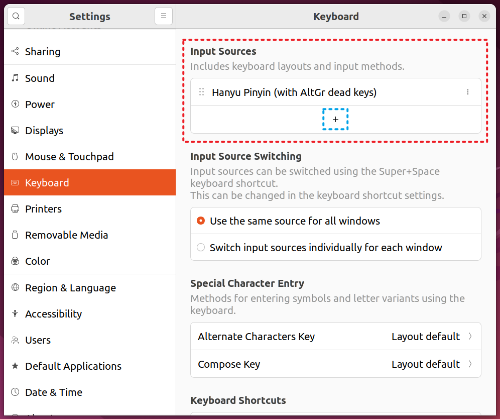
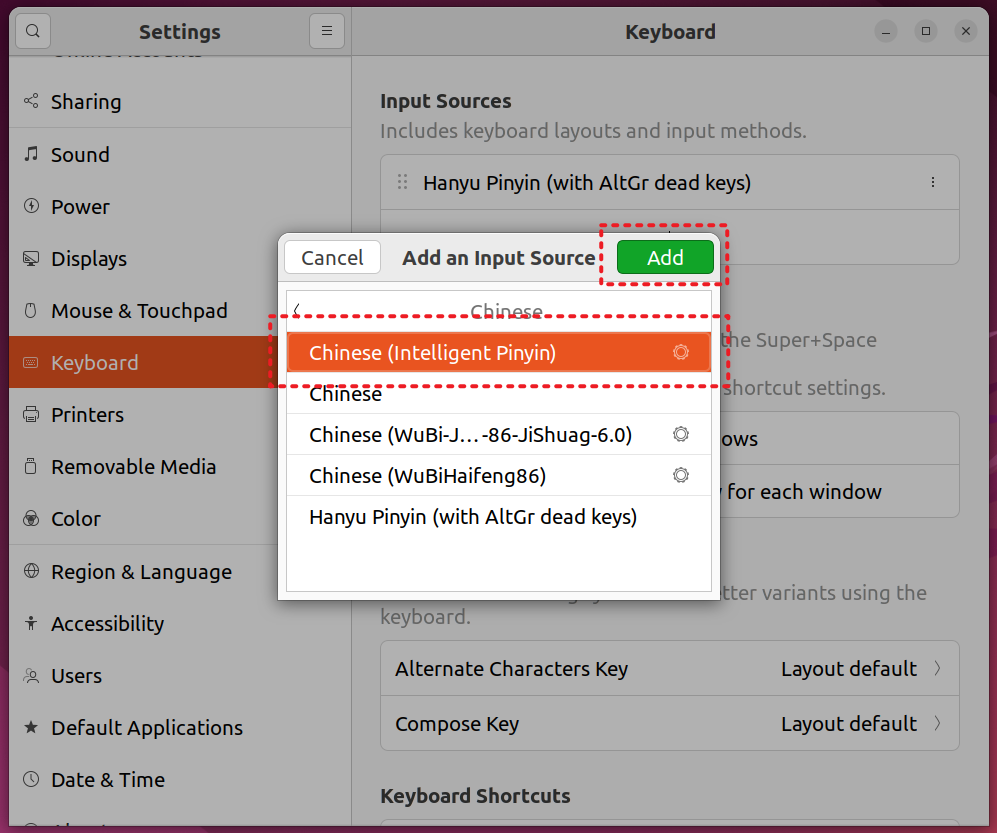
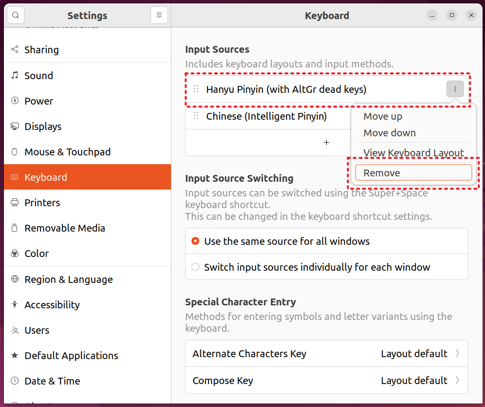

### 概述

本篇记录 Ubuntu 22.04.2 系统在 VMware Workstation 16 中的配置过程。

对于部署配置虚拟机系统这件事，折腾过的人应该都知道创建虚拟机快照的重要性。如果部署的是 Windows 系统，那么创建快照很大程度是因为安装过程耗时太长。

如果部署的是 Linux 系统，那么创建快照则基本上是因为系统被“玩坏了”。毕竟如果对 Linux 系统不够熟悉，很可能会因为错误运行了某些命令行，导致系统出现奇奇怪怪的 BUG 甚至于崩溃。

但无论在虚拟机上部署什么系统，创建快照唯一的共同理由，就是保存当前对虚拟机系统作出的配置！如果说安装部署虚拟机是一件折磨人的事情，那么配置新系统简直可以算得上是顶级折磨了。

### 环境配置

- VMware Workstation 16 Pro（16.2.3 build-19376536）
- Ubuntu 22.04.2（ubuntu-22.04.2-desktop-amd64）

### 注意事项

使用 VMware Workstation 安装虚拟机时，有两点需要注意：

- 新建虚拟机向导中，安装客户机操作系统推荐选择“稍后安装操作系统”，后续在虚拟机设置中可以手动添加安装程序的光盘映像 .iso 文件；
- 新建虚拟机向导中，指定磁盘容量时选择“将虚拟磁盘拆分成多个文件”，这样方便虚拟机文件的移动和保存；
- 虚拟机设置中网络适配器选择 NAT 模式（默认模式），这样虚拟机的网络不容易出错；

如果本地网络构成并不特殊，网络适配器可以选择桥接模式（BRIDGE）。但一定切记不能使用仅主机模式（Host-Only）。仅主机模式下，虚拟机只能和主机通信，无法访问外界网络。

### 安装过程

对于 Ubuntu 22.04.2 来说，安装它的桌面版系统不需要很多的操作，安装过程中基本一直点击确认即可完成。除了期间手动设置用户名密码比较重要外，没什么特别需要留意的地方。



但这里仍有一些推荐设置：

- 选择全英系统。该系统一定不是主用系统，为了能在使用终端时更加地便捷，推荐使用全英显示。大概没有人会想在终端英文字符路径中，掺杂地输入几个中文字符；
- 选择位置时，点击地图或手动输入以选择 Shanghai（GMT+8）。这关乎于系统时间，而系统时间十分重要，稍有偏差都会导致网络无法正常访问。



### 系统配置

该部分仅针对的 Ubuntu 22.04.2 桌面系统，主要包括系统更新、密码变更、显示设置、输入程序及字体安装等比较基础，但却重要的配置。

#### 安装更新

首次进入 Ubuntu 系统时，如果网络没有故障，那么软件更新器会自动弹出询问是否更新：



Software Updater（以前名为 Update Manager）是一个可选的应用程序，它用于升级所有已知来源的 deb 包，同时还包含内核更新，因此推荐安装更新。

如果此前安装过程中选择的定位在中国，那么软件更新器会自动将软件更新源设置为中国服务器，那么此时你就可以选择安装更新。



但如果没有将定位选择在中国，请先更改位置信息以确保系统时间是正确的。随后在软件更新器中把中国服务器设置为下载源，例如将阿里源设置为下载源：



选择好下载源后，点击 Close 保存设置。

#### 密码变更

Ubuntu 22.04.2 系统的安装过程中，并不会要求设置 root 账户密码。默认情况下，系统 root 账户的密码是随机的，这意味着每次重启系统后，该密码都会被重置。

如果需要登录并使用 root 账户，则先需要使用命令修改一次当前普通用户的密码：

```bash
sudo passwd
```

修改后的密码将会作为 root 账户的固定密码，之后 root 账户密码将不再随机生成。

修改密码时如果长度短于 8 位，终端会提示以下信息：

```
BAD PASSWORD: The password is shorter than 8 characters
```

但并不表示密码不能使用，可以继续修改密码。

#### 显示设置

新版的 Ubuntu 22.04.2 桌面系统中采用的桌面环境为 GNOME 42.5，默认使用 Wayland 通讯协议。


但目前系统上的 Wayland 协议存在一定的问题，其他系统是否有问题尚未可知。

具体的问题出现在系统进行缩放时，如果缩放比例不为 100%，那么所有非原生的系统应用都会出现界面模糊的现象。


如果有放大系统全局字体大小的需求，如系统窗口显示字体的大小或终端显示字体的大小，那么不建议在显示设置中改变缩放参数！取而代之，可以使用调整系统字体的大小的辅助功能：


如果希望控制字体的放大比例，例如让字体放大 1.4 倍，可以使用以下命令行：

```bash
gsettings set org.gnome.desktop.interface text-scaling-factor 1.4
```

以上命令直接使用，会同时开启放大字体的功能，不需要提前在设置中修改。

如果任务栏图标在字体改变大小之后显得过小，可以在外观（Appearance）中修改它的大小：


#### 输入程序

如果安装时选择了英文系统，默认开机时中文输入法并不存在。

进入 Region & Language 设置中，选择 Manage Installed Languages。首次进入管理已安装的语言时，会自动出现“受支持语言尚未完整安装”的提示：


点击 Install 等待语言支持程序执行完毕，之后重启系统。

注销/重启系统后，在设置中找到 Keyboard 选项，找到 Input Sources 添加其他的输入源：



选择 Chinese 中的 Chinese (Intelligent Pinyin) 选项：



之后将默认的 Hanyu Pinyin (with AltGr dead keys)/English (US) 或其他首选输入源删除：



注销/重启系统后，中文输入法会默认启用。

#### 代理服务

Tun Mode 暂不成功。

### 个性配置

#### 字体安装

Ubuntu 22.04.2 基本支持 Windows 系统字体，将 .ttf 字体文件放在 ~/home/.fonts 目录下即可。如果目录不存在则创建它，系统将自动识别这些字体。

### 软件管理

本小节介绍一些 Ubuntu 22.04.2 系统中基础的、用于管理的命令。

#### 软件包格式

Ubuntu 默认支持的软件包有两种格式：.deb 格式的软件包和 .snap 格式的软件包。用于安装部署这些软件包的程序，就是软件包管理系统（Package Manager）。

软件包管理系统是在电脑中自动安装、配置、卸载和升级软件包的工具组合，在各种系统软件和应用软件的安装管理中均有广泛应用。

Ubuntu 中管理 deb 软件包的有 dpkg 软件包管理系统及其前端 APT 软件包管理系统，所谓“前端”可以理解为更高级的意思；其次管理 sanp 软件包的是 Snappy 软件包管理系统，但不常使用。

这里需要了解一个关于 .deb 格式软件包的知识点：每个 .deb 格式软件包都具有唯一的 PACKAGE 属性，其对应的值为该 DEB 软件包的包名。

以 Microsoft Edge 浏览器的 .deb 格式软件包为例：

- microsoft-edge-stable_112.0.1722.58-1_amd64.deb

使用以下命令可以查看软件包详情：

```bash
sudo dpkg -I microsoft-edge-stable_112.0.1722.58-1_amd64.deb
```

以下是 microsoft-edge-stable_112.0.1722.58-1_amd64.deb 软件包的信息：

```
new Debian package, version 2.0.
 size 142150282 bytes: control archive=6472 bytes.
    1157 bytes,    12 lines      control              
   13128 bytes,   411 lines   *  postinst             #!/bin/sh
    8283 bytes,   269 lines   *  postrm               #!/bin/sh
    1354 bytes,    42 lines   *  prerm                #!/bin/sh
 Package: microsoft-edge-stable
 Version: 112.0.1722.58-1
 Architecture: amd64
 Maintainer: Microsoft Edge for Linux Team <EdgeLinuxDev@microsoft.com>
 Installed-Size: 493101
 Pre-Depends: dpkg (>= 1.14.0)
 Depends: ca-certificates, fonts-liberation, libasound2 (>= 1.0.17), libatk-bridge2.0-0 (>= 2.5.3), libatk1.0-0 (>= 2.2.0), libatspi2.0-0 (>= 2.9.90), libc6 (>= 2.17), libcairo2 (>= 1.6.0), libcups2 (>= 1.6.0), libcurl3-gnutls | libcurl3-nss | libcurl4 | libcurl3, libdbus-1-3 (>= 1.9.14), libdrm2 (>= 2.4.75), libexpat1 (>= 2.0.1), libgbm1 (>= 17.1.0~rc2), libglib2.0-0 (>= 2.39.4), libgtk-3-0 (>= 3.9.10) | libgtk-4-1, libnspr4 (>= 2:4.9-2~), libnss3 (>= 2:3.31), libpango-1.0-0 (>= 1.14.0), libu2f-udev, libuuid1 (>= 2.16), libvulkan1, libx11-6 (>= 2:1.4.99.1), libxcb1 (>= 1.9.2), libxcomposite1 (>= 1:0.4.4-1), libxdamage1 (>= 1:1.1), libxext6, libxfixes3, libxkbcommon0 (>= 0.5.0), libxrandr2, wget, xdg-utils (>= 1.0.2)
 Provides: www-browser
 Section: web
 Priority: optional
 Description: The web browser from Microsoft
  Microsoft Edge is a browser that combines a minimal design with sophisticated technology to make the web faster, safer, and easier.
```

能清晰从输出信息中知道该软件包的 PACKAGE 属性，及对应的值 micorsoft-edge-stable。

Ubuntu 多数情况下会选择 APT 或 dpkg 软件包管理系统来管理软件，因为大多数软件仅提供 .deb 格式的软件包。虽然它们都用于管理 .deb 格式的软件包，但实际的管理方式有所不同。

APT 软件包管理系统依赖于源，可以把源理解为当前所有可供使用的 .deb 格式软件包合集的远程仓库，同时 APT 会在本地维护一份该远程仓库中所有软件包的 PACKAGE 属性值列表。

在用户使用 APT 安装指定的软件时，需要提供该软件的 PACKAGE 属性值。APT 会在本地属性值列表中查询该值，如果存在对应记录，则从远程仓库（源）中拉取对应的 .deb 格式软件包执行安装。


dpkg 软件包管理系统并不依赖于软件包的 PACKAGE 属性值，它会直接管理 .deb 格式的软件包。

#### 安装/卸载软件

APT 和 dpkg 出于管理软件包形式的差别，使用它们安装或卸载软件时

使用 APT 安装：

```bash
sudo apt install ${deb_package_name}
```

使用 dpkg 安装：

```bash
sudo dpkg -i ${deb_package_fileName}
```

任何程序都逃不开依赖问题，类比 Java 中 JAR 包之间存在的依赖关系，Linux 系统中软件包之间也同样存在依赖关系。

例如，软件 A 依赖于软件 B。这意味着安装软件 A 的时候，必须保证系统上已安装了软件 B。

软件之间依赖关系，在使用 APT 软件包管理系统时并不明显，因为 APT 能够自动解决软件依赖缺失的问题。类比 Java 项目中使用项目管理工具 Maven 能将 JAR 包依赖自动引入一般，APT 软件包管理系统也会在软件存在依赖缺失时，自动将缺失的依赖安装到系统中。

但 dpkg 系统不具备解决依赖缺失的能力，如果使用 dpkg 安装存在依赖缺失的软件包，那么系统会提示依赖缺失并将安装回滚，缺失的依赖会被输出在终端上。

APT 可以解决 dpkg 所遇到的依赖缺失问题：

```bash
sudo apt -f install -y
```

以上命令执行完毕后，就可以再次使用 dpkg 安装此前存在依赖缺失的软件包了。

针对 .deb 格式的软件包，使用 APT 卸载：

```bash
sudo apt remove ${deb_package_name}
```

使用 dpkg 卸载：

```bash
sudo dpkg -r ${deb_package_name}
```


Ubuntu 系统本身自带三个不同的软件包管理器：1. APT；2. dpkg；3. Snappy。其中 APT 和 dpkg 软件包管理器用于处理 .deb 格式的软件包，Snappy 用于处理 .snap 格式的软件包。

关于 APT 和 dpkg 之间的关系：

- APT 最早被设计成 dpkg 的前端，这也是为什么 APT 能够用于管理 .deb 软件包的原因。现在经过 APT-RPM 组织修改后，APT 其实已经支持管理 .rpm 格式的软件包了；

- APT 虽然支持 .rpm 格式的软件包，但大前提是需要安装必要的插件支持。除非迫不得已，否则还是不建议折腾。

- APT 和 dpkg 虽然都支持 .deb 格式的软件包，但有所不同的是 APT 在安装 .deb 包时能自动解决软件包的依赖问题，而 dpkg 则并不能。因此多数情况下，会选择使用 APT 管理 .deb 软件包。

从网络上获取了 .deb 格式的软件包后，如果确认系统中已经安装了该软件所需的所有依赖包（大概率是无法确认的），那可以选择使用 dpkg 进行安装：

```bash
sudo dpkg -i <.deb_package>
```

例如 Microsoft Edge 浏览器，它所需的其他软件依赖包原本已存在于 Ubuntu 22.04.2 系统中，因此可以使用 dpkg 安装从 Microsoft 官网获取到的 .deb 格式软件包：

- microsoft-edge-stable_112.0.1722.58-1_amd64.deb

进入软件包路径，运行安装命令即可：

```bash
sudo dpkg -i microsoft-edge-stable_112.0.1722.58-1_amd64.deb
```

上面说到 APT 管理器也支持 .deb 格式软件包的安装，格式如下：

```bash
sudo apt install ./<.deb_package>
```

同样以 Microsoft Edge 浏览器包为例，安装命令为：

```bash
sudo apt install ./microsoft-edge-stable_112.0.1722.58-1_amd64.deb
```

实际安装过程中，使用 APT 命令安装 Edge 时大概率会出现以下错误：

```
N: Download is performed unsandboxed as root as file '/home/dylan/microsoft-edge-stable_112.0.1722.58-1_amd64.deb' couldn't be accessed by user '_apt'. - pkgAcquire::Run (13: Permission denied)
```

有兴趣可以尝试了解这些错误信息的含义，本文不对错误进行解析。建议在 APT 安装出现错误时，选择卸载目标软件，而后尝试使用 dpkg 命令重新安装。

如果 dpkg 命令需要安装的软件存在依赖问题，那么可以在命令执行出错后，使用 APT 命令来曲线解决依赖问题：

```bash
sudo apt -f install -y
```

这是系统本身就存在的、用于解决依赖缺失的命令逻辑，有兴趣可以了解一下原理。总之所需依赖软件尽数安装完毕后，再次执行原先无法完成的 dpkg 命令，就能完成目标 .deb 软件包的安装了。

如果迫切想知道目标 .deb 软件包的各种依赖，可以运行以下命令：

```bash
dpkg --info <.deb_package> | grep Depends
```

它将输出的目标软件包的所有依赖，但通常这不会有太大的用处，因为依赖一般十分多，数量多到无法一一验证当前系统中是否存在该依赖。

或许最适合判断目标 .deb 软件包是否缺失依赖的方式，就是看使用 dpkg 安装它时是否无法完成。


```
sudo apt install <sources_package>
```


```bash
sudo apt remove <dpkg_installed_name/apt_installed_name>
```


tar.gz

#### 卸载软件

#### 查看已安装软件列表

如果希望查看所有使用

```bash
sudo apt list --installed
```


```
snap list
```


#### 

#### 安装位置