### 概述

Windows Subsystem for Linux（WSL）全称适用于 Linux 的 Windows 子系统。

WSL 可以让开发人员直接在 Windows 上按原样运行 GNU/Linux 环境（包括大多数命令行工具、实用工具和应用程序），且不会产生传统虚拟机或双启动设置开销。详情参考：[WSL 文档](https://learn.microsoft.com/zh-cn/windows/wsl/)。

### 虚拟化技术

WSL 依赖于虚拟化技术，需要在 Windows 功能中启用 Hyper-V 功能和虚拟机平台功能，请参考：[虚拟化技术](./Hyper-V & Easy-GPU-PV.md/###虚拟化技术)。

### 安装 WSL

与其说是安装 WSL 程序，倒不如说是为 WSL 程序选择安装适合的 Linux 发行版（Linux Distribution）。对于大多数 Windows 10 或以上版本的系统来说，它们都已经默认支持 WSL 了。

可以通过系统版本的方式，来判断目前系统支持的 WSL 版本有什么。目前 WSL 分为 WSL1 和 WSL2，就性能表现来说，推荐使用 WSL2。

打开命令提示符 CMD 程序（不能用 PowerShell）运行以下命令：

```bash
ver
```

可以得到当前系统的版本信息：

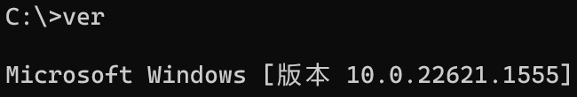

如果版本号低于 18917 则表示当前系统只支持 WSL1，如果高于 18917 则表示系统同时支持 WSL1 和 WSL2。

上述例子中，版本号为 22621 就表示当前系统同时支持 WSL1 和 WSL2。

WSL 程序默认存储在 C:\Windows\System32 目录中：

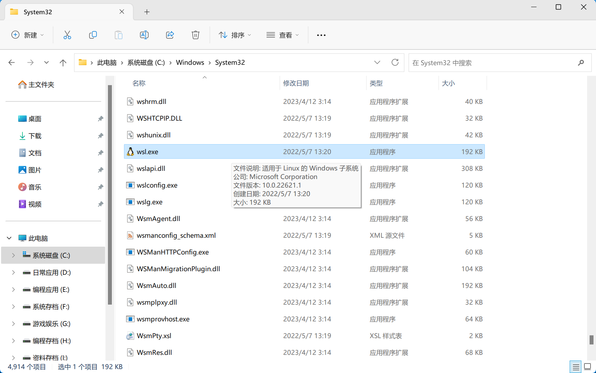

可以看到该程序的企鹅图标是 Linux 系统的标志之一。

虽然 WSL 程序已存在于系统目录中，但尚未可用，直接调用往往只能看到一个一闪而过的终端窗口。

因为执行 wsl.exe 程序时，它需要启动其默认选择的 Linux 发行版系统。但系统中尚未安装部署过任何的 Linux 发行版，因此直接调用 wsl.exe 程序暂时是没用的。

**或者可以将 WSL 理解为连接 Windows 系统和 Linux 系统的桥梁工具，使用它是为了在 Windows 上建立与 Linux 系统的高效连接。显然，现在 Windows 系统和 WSL 程序都已准备妥当，差的只有 Linux 系统了。**

#### 使用 WSL2 版本

WSL2 相较于 WSL1 拥有更好的性能，对于新安装的 Linux 发行版来说，建议使用 WSL2。系统默认使用的 WSL 版本没办法直接进行查询，建议运行版本设置命令，以确保后续使用的都是 WSL2 版本。

需要确保 Linux 发行版使用的是 WSL2 版本，需运行以下命令：

```shell
wsl --set-default-version 2
```

只要运行一次，那么后续默认安装或新安装的 Linux 发行版都会使用 WSL2。

#### 安装 Linux 发行版

官方所提供的安装 WSL 的文档，实际并不是真正意义上的安装 WSL。与其说是安装 WSL，不如说是将指定的 Linux 发行版部署在本地，使得 WSL 能使用它。

运行以下命令，默认会将名为 Ubuntu 的 Linux 发行版部署在本地：

```shell
wsl --install
```

该命令实际等同于：

```shell
wsl --install --distribution Ubuntu
```

从命令的形式看，不难得知目标 Linux 发行版是可选的。事情确实如此，所有受 WSL 支持的目标 Linux 发行版，都可以通过在线查询的方式获取。

运行以下命令，可以得到当前所有受支持的 Linux 发行版列表：

```shell
wsl --list --online
```

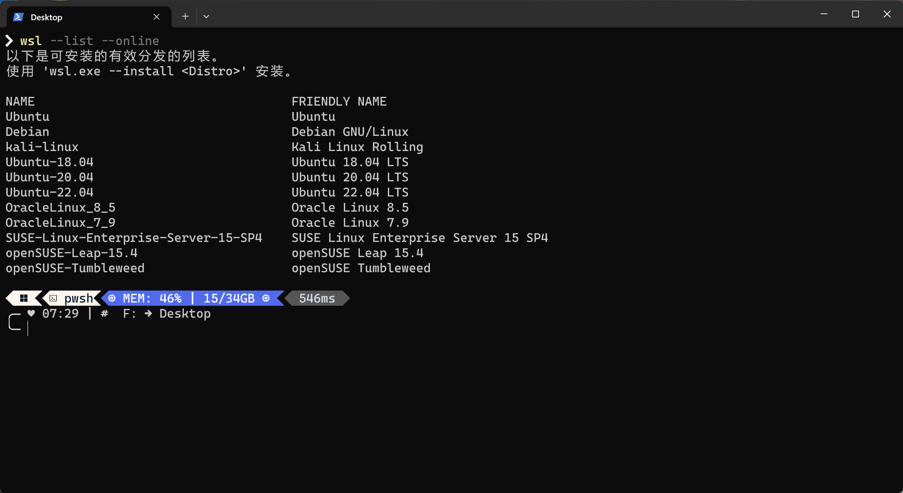

需要注意，该命令本质是从网络上拉取列表。如果网络不好，则可能出现错误提示（不要慌，再试一次）：

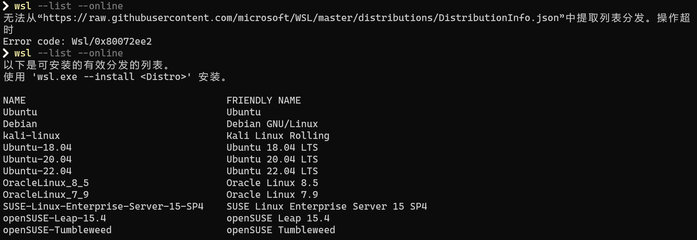

可以看到默认安装的 Ubuntu 发行版也存在于列表中。

如果不希望使用默认的 Ubuntu 发行版，可以在安装时使用 --distrubution 或 -d 选项，指定其中一个受支持的发行版的名字。例如安装 Ubuntu-22.04 发行版：

```shell
wsl --install -d Ubuntu-22.04
```

这个命令同时也用于部署其他的 Linux 发行版，使用该命令可以将多个不同的 Linux 发行版部署在本地。

#### 查看 Linux 发行版

运行以下命令，可以查看所有已部署的 linux 发行版信息：

```
wsl --list --verbose
```


其中，NAME 即为对应 Linux 发行版的名称，STATE 表示该系统是否运行中，VERSION 表示其使用的 WSL 版本。

#### 默认 Linux 发行版

查看 Linux 发行版信息后，不难留意到位于 NAME 之前的 * 标志。它表示当前执行 wsl.exe 程序时，默认使用的 Linux 发行版系统。

例如上述例子中，默认启动的 Linux 系统是 Ubuntu-22.04，这意味着直接执行 wsl.exe 程序，就会间接启动并使用 Ubuntu-22.04 系统。

进入 wsl.exe 程序后，执行以下命令可以查询 Ubuntu 系统的版本号：

```bash
lsb_release -a
```

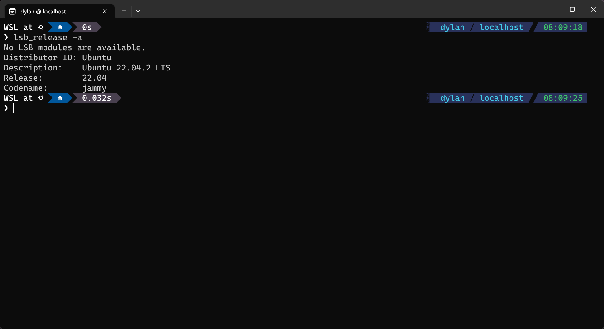

运行以下命令，可以更改默认启动的 Linux 发行版：

```shell
wsl --set-default <distrubution name>
```

以上例子中需要运行命令：

```bash
wsl --set-default Ubuntu-20.04
```

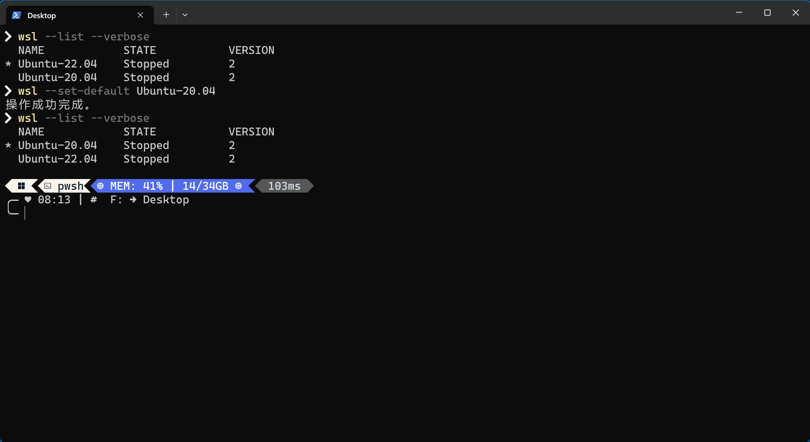

可以看到默认使用的发行版已改变，再次打开 WSL 可以查看到版本信息改变：

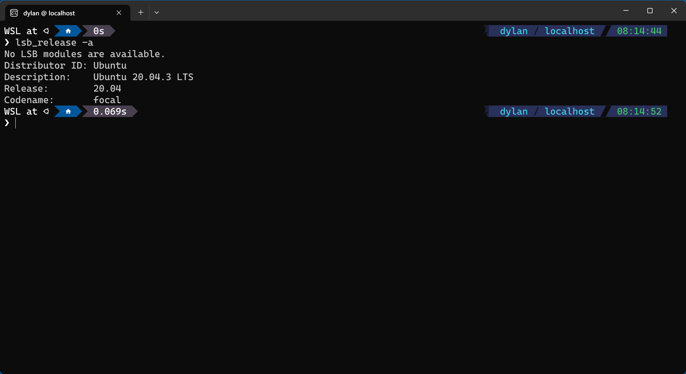

这意味着默认使用的 Linux 系统也改变了。

#### 更改 WSL 版本

如果一开始并没有执行 WSL2 默认版本的配置，即没有执行以下命令：

```shell
wsl --set-default-version 2
```

那么查看当前所有已部署的 Linux 发行版时，可能就会出现 VERSION 为 1 的情况：

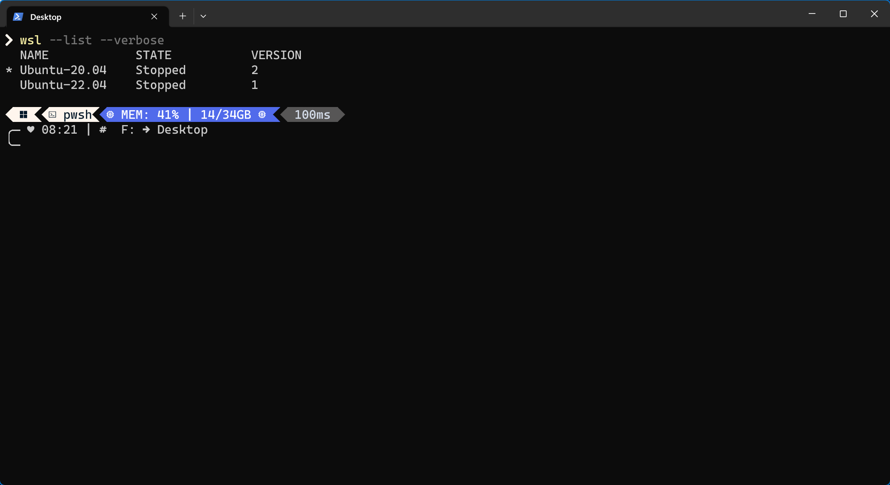

可以看当前 Ubuntu-22.04 发行版使用的是 WSL1，所幸这并非无可挽救。

运行以下命令，可更改当前已部署的 Linux 发行版所使用 WSL 版本：

```shell
wsl --set-version <distribution name> <versionNumber>
```

以上例子中需要运行命令：

```shell
wsl --set-version Ubuntu-22.04 2
```

WSL 版本的转换需要一定的时间：

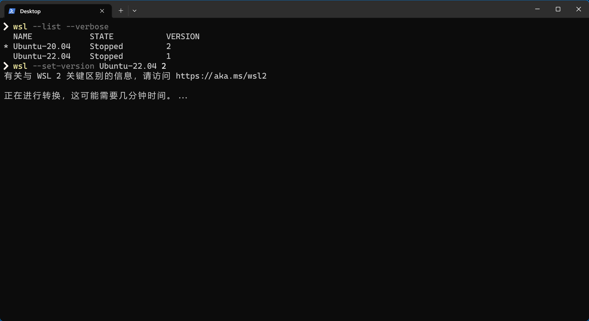

转换完毕后，可查看到对应 Linux 发行版所使用的 WSL 版本已变更：

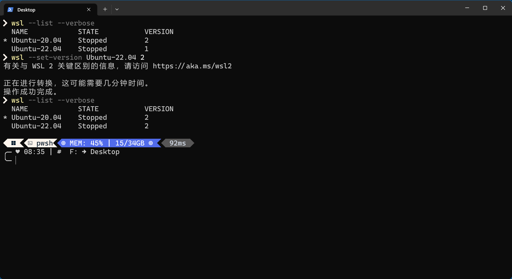

#### 备份 Linux 发行版

使用虚拟系统的最大优点，即系统的可恢复性。WSL 提供了方便的导入/导出发行版的命令，可随时将 Linux 系统导出为 .tar 文件，或将 .tar 文件恢复成 Linux 系统。

以下命令用于导出 Linux 发行版：

```shell
wsl --export <Distribution Name> <FileName>
```

以下命令用于导出 Linux 发行版：

```shell
wsl --import <Distribution Name> <InstallLocation> <FileName>
```

以 Ubuntu-22.04 为例，需要将它导出则运行以下命令：

```shell
wsl --export Ubuntu-22.04 C:\Ubuntu-22.04.tar
```

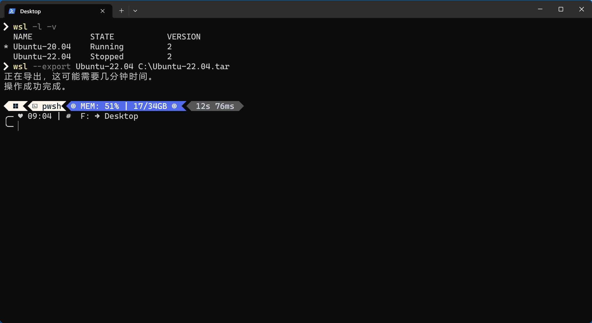

后续需要将 Ubuntu-22.04 重新导入，则运行以下命令：

```
wsl --import My-Ubuntu I:\Virtual-Machine C:\Ubuntu-22.04.tar
```

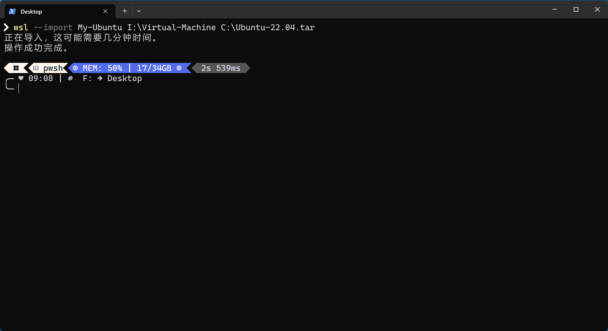

导入的 Linux 发行版会以指定的名字，出现在当前可运行的发行版列表中：

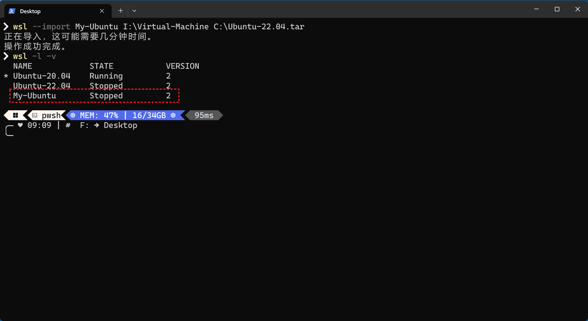

#### 卸载 Linux 发行版

假如不再需要使用某个 Linux 发行版，或需要删除当前的 Linux 发行版重新安装导入其他的同名发行版时，就需要使用到卸载或注销 Linux 发行版的命令。

以下命令用于卸载或注销指定名称的 Linux 发行版：

```shell
wsl --unregister <DistributionName>
```

以 My-Ubuntu 发行版为例，卸载它需要运行命令：

```shell
wsl --unregister My-Ubuntu
```

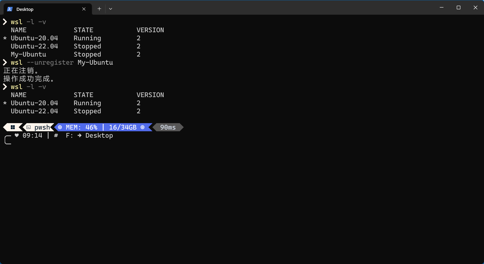

卸载或注销操作会一并将相关的文件删除，不存在文件冗余的情况。

#### 其他 WSL 操作

以下命令用于更新 WSL：

```shell
wsl --update
```

该命令有一个可选的 --web-download 参数，使用它表示从 GitHub 下载更新，而不是从 Microsoft Store 下载。

以下命令用于关闭 WSL：

```shell
wsl --shutdown
```

该命令会立即终止所有正在运行的发行版和 WSL 2 轻量级实用工具虚拟机。

如果只需要终止指定的发行版或阻止其运行，可以使用以下命令：

```shell
wsl --terminate <distribution name>
```

例如终止 Ubuntu-20.04 发行版的运行：

```shell
wsl --terminate Ubuntu-20.04
```

实际上，退出发行版 Bash 之后，发行版会自行退出。但存在一种情况，会让发行版开机时自启。

### 访问 Linux 文件

 如果要从 Windows 访问 Linux 文件，可通过以下路径进行访问：

```
\\wsl$\<distribution-name>
```

以 Ubuntu-20.04 为例，需要访问它的内部文件，直接访问以下路径即可：

```shell
\\wsl$\Ubuntu-20.04
```

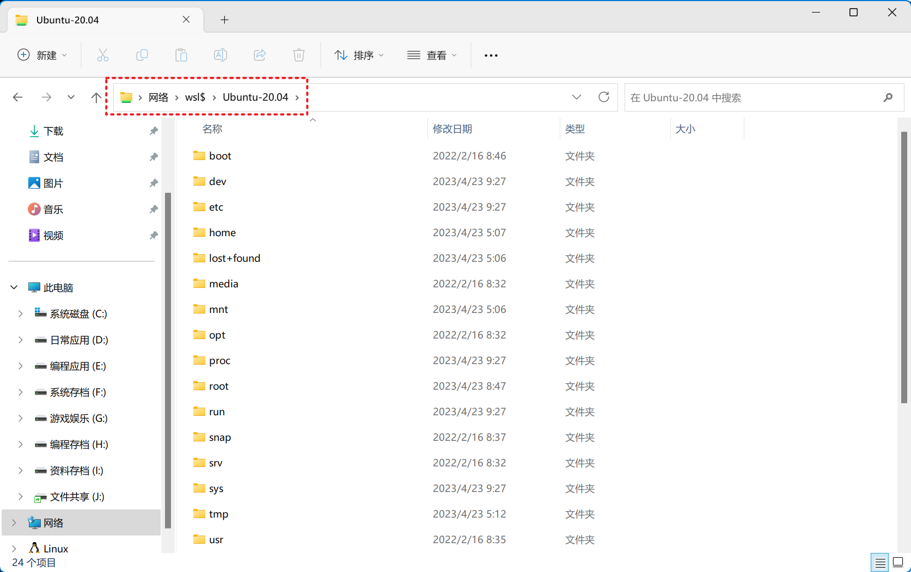

Linux 发行版的虚拟驱动器通常名为 ext4.vhdx 且被存储在 AppData 内相关的 WSL 目录中，而这种虚拟驱动器通常可以被挂载。

不过官方不建议使用 Windows 工具或编辑器修改、移动或访问 AppData 目录中的 WSL 相关文件。以上使用路径访问 Linux 文件的方式，是官方所推荐的访问形式。

但该形式存在一个问题，Linux 发行版在不使用时总是处于 Stopped 状态：

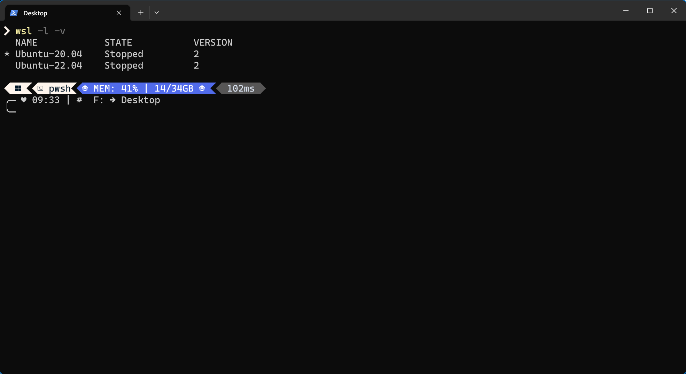

而每次访问 Linux 文件时，如果目标发行版处于 Stopped 状态，则 WSL 需要先将其启动，之后才能允许访问。换言之，如果目标 Linux 发行版尚未启动，那么直接访问 Linux 文件时就会有一定的卡顿发生。

### 自启 Linux 发行版

WSL 实则并未提供任何的方法，能让 Linux 发行版随开机启动。但实则可以利用访问 Linux 文件时的特定，间接让指定的 Linux 发行版随开机启动。

方法就是将访问指定 Linux 发行版的链接，映射为网络驱动器：

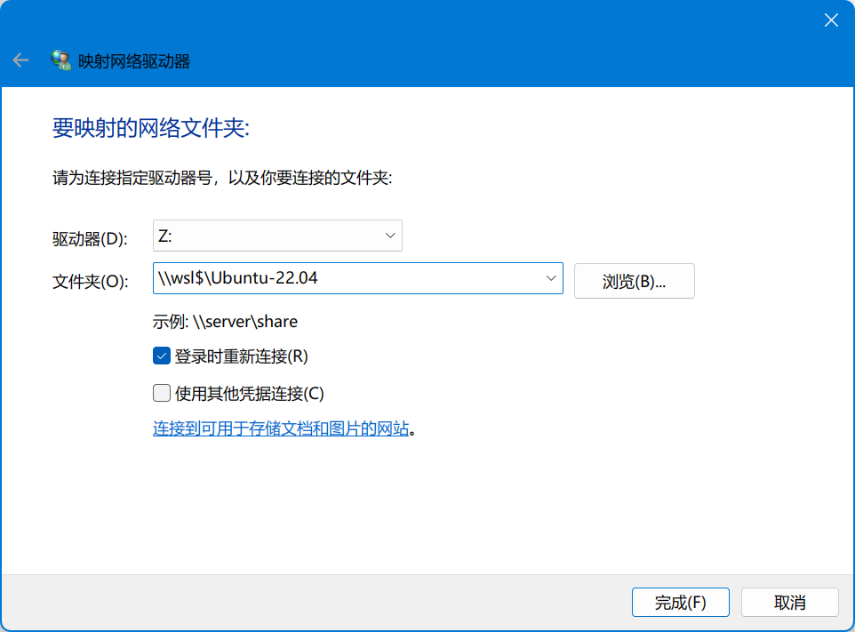

添加完毕后，电脑中会出现该 Linux 发行版的网络位置：

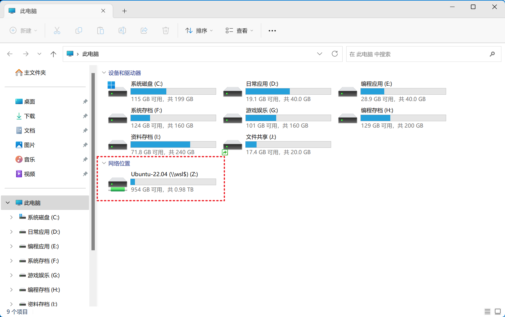

使用命令行查看所有 Linux 发行版的状态：

```shell
wsl --list --verbose
```

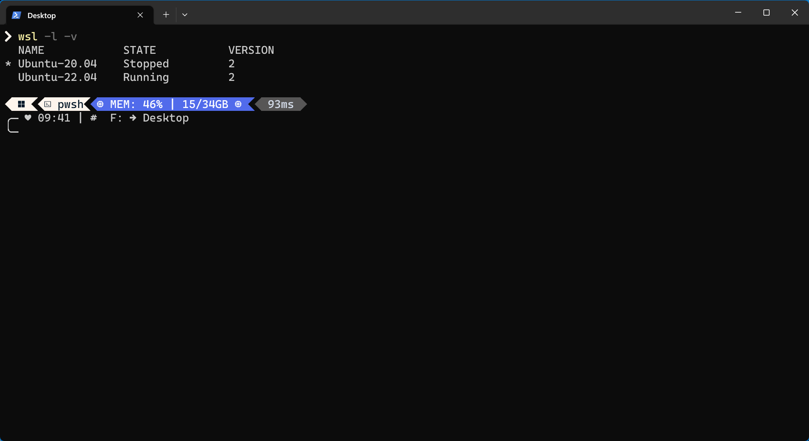

不难发现 Ubuntu-22.04 发行版会一直处于 Running 状态。

由于重启计算机后，网络位置也会重新连接，即表示对应的 Linux 发行版需要先行启动，自此间接达成了自启 Linux 发行版的目的。

### 修改 root 密码

默认情况下，WSL 中的 Linux 发行版系统内 root 用户没有密码保护。但这并不意味着使用 root 权限时不需要提供密码，为了便于使用，我们需要将 root 密码进行变更。

当 WSL 中的 Linux 发行版系统用户第一次修改账户密码时，该密码会同时作为 root 用户的新密码。

进入 Linux 系统中执行以下命令修改当前用户的密码：

```bash
sudo passwd
```

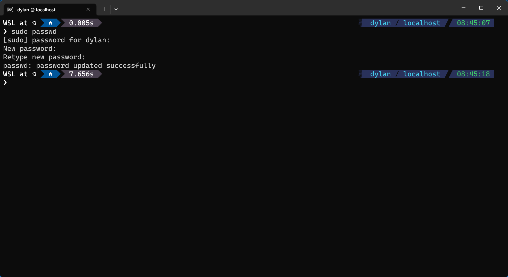

修改完毕后，该密码即作为 root 用户的新密码。

将用户切换为 root 使用以下命令：

```bash
su root
```

显示当前用户名称，使用以下命令：

```bash
whoami
```

切换 root 用户测试密码可用性：

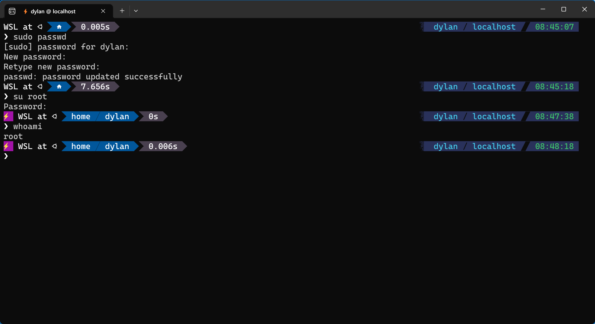

显然，root 用户的密码已成功变更。