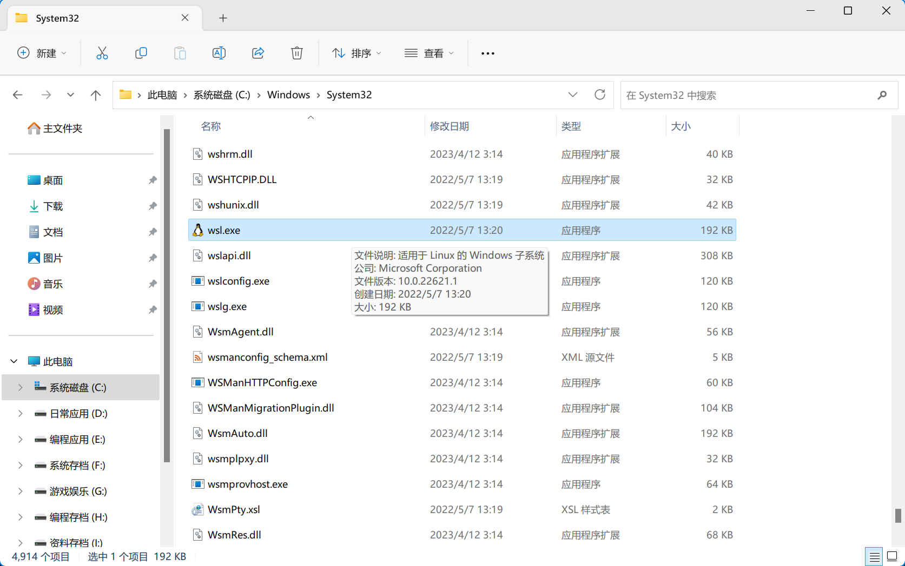
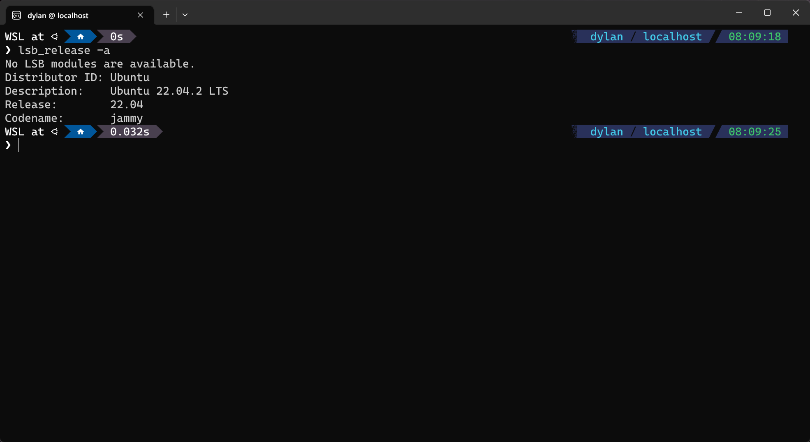
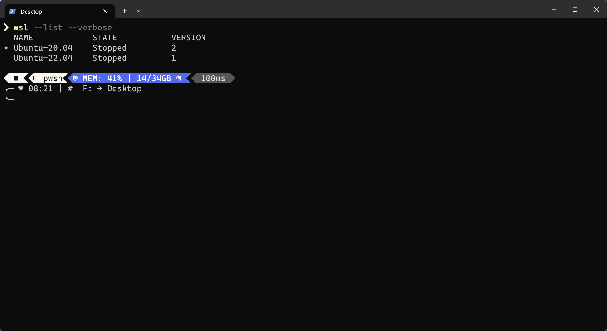
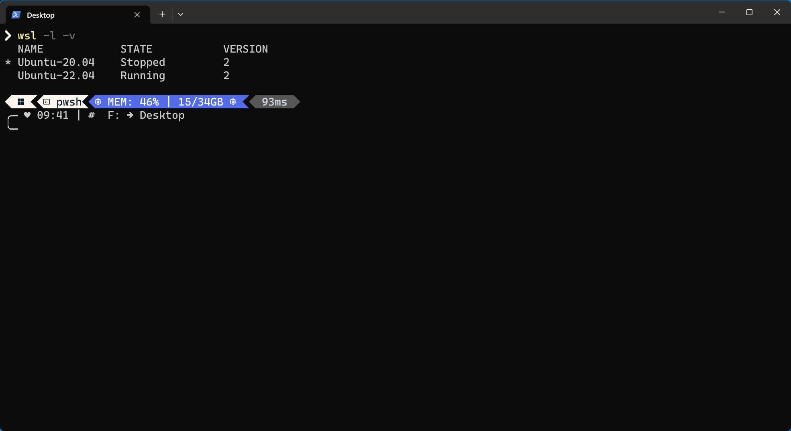

### 概述

Windows Subsystem for Linux（WSL）全称适用于 Linux 的 Windows 子系统。

WSL 可以让开发人员直接在 Windows 上按原样运行 GNU/Linux 环境（包括大多数命令行工具、实用工具和应用程序），且不会产生传统虚拟机或双启动设置开销。详情参考：[WSL 文档](https://learn.microsoft.com/zh-cn/windows/wsl/)。

### 虚拟化技术

WSL 依赖于虚拟化技术，需要在 Windows 功能中启用 Hyper-V 功能和虚拟机平台功能，请参考：[虚拟化技术](./Hyper-V & Easy-GPU-PV.md/###虚拟化技术)。

### Linux 发行版

在 WSL 尚未安装任何 Linux 发行版的情况下，使用 Windows PowerShell 运行以下命令：

```shell
wsl
```

控制台将输出与 wsl.exe 程序相关的参数说明：


该中文版说明中，会出现许多“分发”的字眼，这个翻译实际并不准确。英文文档中 distribution 在中文文档里不应该被翻译为“分发”，而应翻译为“发行版”。

Linux 发行版即 Linux Distribution，它也被称作 GNU/Linux 发行版。它是为一般用户预先集成好的 Linux 操作系统，用户不需要重新编译，直接安装发行版后，只需要小幅度更改设置即可使用。

Linux 发行版通常以软件包管理系统来进行应用软件的管理，一般的 Linux 发行版都会预先集成包括桌面环境、办公包、媒体播放器、数据库等应用软件（类比 Android 的预装应用）。

微软在许多需要说明命令用途的地方，将 distribution 译为“分发”，具有一定的迷惑性。因为在 Linux Distribution 等专有名词中，distribution 应该被翻译为“发行版”而非“分发”。

除此之外，Linux Distribution 也常被缩写为 Linux Distro，其中 distro 为 distribution 的缩写形式，它们都是“发行版”的意思。

可以将 Linux 发行版看作 Linux 系统的子集，或者说 Linux 发行版是 Linux 系统的具体解释。例如 CentOS 是 Linux 发行版，但同时它也是 Linux 系统。因此，从某种意义上来说，可将 Linux 发行版与 Linux 系统看作是同一个东西。

更多关于 Linux 发行版的资料，请参考：[Linux Distribution - WIKI](https://zh.wikipedia.org/wiki/Linux%E5%8F%91%E8%A1%8C%E7%89%88)。

### 关于终端命令

后续涉及诸多 Windows PowerShell 命令，其中有一点注意事项，即为终端命令选项提供的参数，一般不能包含空格符号。

如果参数包含空格符号，则需要用单引号或双引号将其包裹，或将空格符号转义。

假如在 H:\ 盘下拥有一个名为 proxy rules 的目录，以下演示不同命令进入该目录的方法。

CMD 命令书写如下（命令顺序不重要，但盘符切换不能使用 cd 命令）：

```bash
h:
cd "proxy rules"
```

PowerShell 命令书写如下：

```bash
cd 'h:\proxy rules'
```

Bash 命令书写如下：

```bash
cd /h/proxy\ rules
####### OR #######
cd '/h/proxy rulse'
```

以上使用单引号的命令同时兼容使用双引号，但使用双引号的命令不兼容使用单引号。其次，对于不包含空格符号的参数来说，单引号或双引号可省略不写。

例如以下命令：

```shell
wsl --install --distribution Ubuntu
```

等价以下命令：

```shell
wsl --install --distribution 'Ubuntu'
```

如果是为了养成良好的编程习惯，那么不省略单引号或双引号是更好的方案。

### WSL

对于大多数 Windows 10 或以上版本的系统来说，它们都已经默认支持 WSL 了，可以通过区分系统版本，来判断目前系统支持的 WSL 版本有什么。

不同版本的 WSL 并不是非此即彼的存在，同一个 Windows 系统可同时兼容 WLS 1 和 WSL2。

| 功能                                           | WSL 1 | WSL 2 |
| :--------------------------------------------- | :---- | :---- |
| Windows 和 Linux 之间的集成                    | ✅     | ✅     |
| 启动时间短                                     | ✅     | ✅     |
| 与传统虚拟机相比，占用的资源量少               | ✅     | ✅     |
| 可以与当前版本的 VMware 和 VirtualBox 一起运行 | ✅     | ✅     |
| 托管 VM                                        | ❌     | ✅     |
| 完整的 Linux 内核                              | ❌     | ✅     |
| 完全的系统调用兼容性                           | ❌     | ✅     |
| 跨 OS 文件系统的性能                           | ✅     | ❌     |

WSL 目前仅有 WSL1 和 WSL2 两个版本，就性能表现上推荐使用 WSL2。如果 Windows 系统版本号低于 18917 则表示当前系统只支持 WSL1，如果高于 18917 则表示系统同时支持 WSL1 和 WSL2。

查看系统版本信息，需要打开命令提示符 CMD 程序运行以下命令：

```bash
ver
```

使用 Windows PowerShell 则运行以下命令：

```shell
cmd 'ver'
```

当前系统的版本信息会输出在控制台中：


上述例子中，版本号为 22621 就表示当前系统同时支持 WSL1 和 WSL2。

WSL 程序默认存储在 C:\Windows\System32 目录中：



该程序的企鹅图标即为 Linux 的典型标志。

虽然 WSL 程序已存在于系统中，但实际尚未可用，直接调用往往只能看到一个一闪而过的终端窗口。

因为调用 wsl.exe 程序时，它需要间接启动当前默认的 Linux 发行版，显然系统尚未安装任何的 Linux 发行版，这意味着现在调用 wsl.exe 程序毫无用处。

一种更为浅显的理解，可以把 WSL 看作连接 Windows 系统和 Linux 系统的桥梁，即使用 WSL 可以在 Windows 上建立与 Linux 系统的高效连接。

显然，目前 Windows 系统和 WSL 程序都已准备妥当，唯一缺失的仅有 Linux 系统。

#### 使用 WSL2 版本

安装 Linux 发行版前，需要确认安装发行版时所使用的 WSL 版本是什么。由于 WSL2 相较于 WSL1 拥有更好的虚拟性能，因此建议后续安装的 Linux 发行版均使用 WSL2。

遗憾的是，即便能够通过查询系统版本号的方式，确认系统是否支持 WSL2，但这却并不意味着支持 WSL2 的系统默认使用的 WSL 版本为 WSL2！

在无安装任何 Linux 发行版的情况下，WSL 亦无提供任何用于查询当前 WSL 版本的命令。因此推荐显式地运行设置版本为 WSL2 的命令，以确保后续安装的 Linux 发行版均使用 WSL2。

以下命令可以确保后续安装的 Linux 发行版均使用 WSL2：

```shell
wsl --set-default-version '2'
```

该命令只需要运行一次，后续默认安装或新安装的 Linux 发行版都会使用 WSL2。

#### 安装 Linux 发行版

官方所说的“安装 WSL”并平常所理解安装，与其说“安装 WSL”倒不如说是“将指定的 Linux 发行版安装到本地”。一旦本地安装了 Linux 发行版，就能通过 WSL 访问并使用它。

以下命令会将默认的 Linux 发行版安装到本地：

```shell
wsl --install
```

该命令实际等同于：

```shell
wsl --install --distribution 'Ubuntu'
```

从命令的形式看，可以知道“默认的 Linux 发行版”就是“Ubuntu”发行版。通过修改 --distribution 选项的参数，可以安装其他的 Linux 发行版。

但 WSL 并非支持任意的 Linux 发行版，想要获取所有受支持的 Linux 发行版列表，需要使用命令行在线查询获取。

以下命令用于查询所有 WSL 支持安装的 Linux 发行版列表：

```shell
wsl --list --online
```


需要注意，该命令本质是从网络上拉取列表。如果网络不佳，则可能出现错误提示：


其中 NAME 即为 -\-distribution 选项所能接受的参数，FRIDENDLY NAME 则为更加详解的版本名称，能够在列表中看到默认安装的“Ubuntu”发行版。

如果不希望使用默认的 Ubuntu 发行版，可以在安装时使用 -\-distrubution 或 -d 选项指定发行版的名称。例如安装 Ubuntu-22.04 发行版：

```shell
wsl --install -d 'Ubuntu-22.04'
```

这个命令同时使用于安装其他的 Linux 发行版，这样可以将多个不同的 Linux 发行版安装到本地。

安装完毕后，开始菜单中会出现访问 WSL 程序的入口：


#### 查看 Linux 发行版

以下命令用于查看所有已安装 Linux 发行版的信息：

- NAME 表示 Linux 发行版名称；
- STATE 表示 Linux 发行版所处状态；
- VERSION 表示 Linux 发行版使用的 WSL 版本。

```shell
wsl --list --verbose
```


#### 默认 Linux 发行版

查看 Linux 发行版信息时，不难留意到位于行首的 * 标志。它表示当前调用 wsl.exe 程序时，默认使用的 Linux 发行版是什么。

例如上述例子中，默认的 Linux 发行版为 Ubuntu-22.04，这意味着调用 wsl.exe 程序时，就会启动并使用 Ubuntu-22.04 发行版。

进入 wsl.exe 程序后，运行以下命令可以查询 Ubuntu 系统的版本号：

```bash
lsb_release -a
```



回到 PowerShell 中运行以下命令，可以更改默认启动的 Linux 发行版：

```shell
wsl --set-default <distrubution name>
```

在上述例子中，需要运行命令：

```bash
wsl --set-default 'Ubuntu-20.04'
```


再次调用 wsl.exe 打开 Linux Bash 终端，并查询 Ubuntu 版本信息：


可以看到发行版信息已改变，这意味着默认使用的 Linux 发行版确实改变了。

#### 更改 WSL 版本

如果一开始并没有配置 WSL 默认版本，即没有运行以下命令：

```shell
wsl --set-default-version '2'
```

那么查看当前所有已安装的 Linux 发行版时，就可能出现 VERSION 为 1 的情况：



示例中 Ubuntu-22.04 发行版使用的 WSL 版本为 WSL1，所幸这并非无可挽救。

以下命令用于更改当前已安装 Linux 发行版所使用 WSL 版本：

```shell
wsl --set-version <distribution name> <versionNumber>
```

在上述例子中，需要运行命令：

```shell
wsl --set-version 'Ubuntu-22.04' '2'
```

WSL 版本的转换需要一定的时间：


转换完毕后，可查看到对应 Linux 发行版所使用的 WSL 版本已变更：


#### 备份 Linux 发行版

使用虚拟系统的最大优点，莫过于系统的可恢复性了。WSL 提供了方便的导入/导出发行版系统的命令，可随时将 Linux 发行版导出为 .tar 文件，或将 .tar 文件恢复成 Linux 发行版。

以下命令用于导出 Linux 发行版：

```shell
wsl --export <Distribution Name> <FileName>
```

以下命令用于导入 Linux 发行版：

```shell
wsl --import <Distribution Name> <InstallLocation> <FileName>
```

以 Ubuntu-22.04 为例，需要将它导出至系统磁盘，则运行以下命令：

```shell
wsl --export 'Ubuntu-22.04' 'C:\Ubuntu-22.04.tar'
```


后续需要将 Ubuntu-22.04 重新导入 WSL 中，则运行以下命令：

```shell
wsl --import 'My-Ubuntu' 'I:\Virtual Machine' 'C:\Ubuntu-22.04.tar'
```


导入的 Linux 发行版会以导入时指定的发行版名称，出现在当前已安装的发行版列表中：


#### 卸载 Linux 发行版

假如不再需要使用某个 Linux 发行版，或需要删除当前的 Linux 发行版重新安装或导入其他的同名的发行版时，就需要使用到卸载或注销 Linux 发行版的命令。

以下命令用于卸载或注销指定名称的 Linux 发行版：

```shell
wsl --unregister <DistributionName>
```

以 My-Ubuntu 发行版为例，卸载它需要运行命令：

```shell
wsl --unregister 'My-Ubuntu'
```


卸载或注销操作会一并将相关的文件删除，不用担心文件冗余的情况。

#### 其他 WSL 操作

以下命令用于更新 WSL：

```shell
wsl --update
```

该命令有一个可选的 -\-web-download 选项，使用它表示更新会从 GitHub 下载，而不从 Microsoft Store 下载。

以下命令用于关闭 WSL：

```shell
wsl --shutdown
```

该命令会立即终止所有正在运行的发行版和 WSL 2 轻量级实用工具虚拟机。

如果只需要终止指定的发行版或阻止其运行，可以使用以下命令：

```shell
wsl --terminate <distribution name>
```

例如终止 Ubuntu-20.04 发行版的运行：

```shell
wsl --terminate 'Ubuntu-20.04'
```

实际上，退出 Linux Bash 之后对应的 Linux 发行版会自动停止运行。不过存在一种特殊的方法，使用该方法能让 Linux 发行版保存运行状态，并随系统启动而自动运行。

### 访问 Linux 文件

如果要从 Windows 访问 Linux 文件，可通过路径访问：

```
\\wsl$\<distribution-name>
```

以 Ubuntu-20.04 为例，需要访问 Linux 系统文件，则访问以下路径即可：

```
\\wsl$\Ubuntu-20.04
```


Linux 发行版的虚拟驱动器通常名为 ext4.vhdx 且被存储在 AppData 内相关的 WSL 目录中，这种虚拟驱动器通常可以被挂载。

不过官方不建议使用任何 Windows 工具或编辑器修改、移动或访问 AppData 目录中的 WSL 相关文件。使用路径访问 Linux 文件的方式，是官方所推荐的唯一访问形式。

但该形式存在一个问题，Linux 发行版在不使用时总是处于 Stopped 状态：


如果目标发行版处于 Stopped 状态，那么访问该发行版的系统文件时，WSL 需先将该发行版启动，随后 Windows 系统才能到发行版文件。

换言之，如果目标 Linux 发行版尚未启动，那么直接访问目标 Linux 文件就会出现卡顿的情况。

### 自启 Linux 发行版

WSL 实则并未提供任何让 Linux 发行版随开机启动的放，但可以利用 Windows 系统访问 Linux 系统文件的特点，间接让指定的 Linux 发行版随开机启动。

将访问指定 Linux 发行版系统文件的链接，映射为网络驱动器：


添加完毕后，电脑中会出现该 Linux 发行版的网络位置：


使用命令行查看所有已安装 Linux 发行版的状态：

```shell
wsl --list --verbose
```



将看到 Ubuntu-22.04 发行版会一直处于 Running 状态。

由于重启计算机后，网络位置也会重新连接，则对应的 Linux 发行版需要启动后网络位置才能完成重新连接，自此间接达成了自启 Linux 发行版的目的。

### 修改 root 密码

默认情况下，安装 Linux 发行版后，系统内默认的 root 密码是随机的，这意味着每次开机都会有一个新的 root 密码。为便于使用，需要变更发行版 root 用户的密码为固定的。

进入 Linux Bash 中使用以下命令修改当前用于的密码：

```bash
sudo passwd
```


修改完毕后，该密码即会作为 root 用户的新密码。

将用户切换为 root 使用以下命令：

```bash
su root
```

显示当前用户名称，使用以下命令：

```bash
whoami
```

测试 root 用户密码的可用性：


显然 root 用户密码已成功变更。